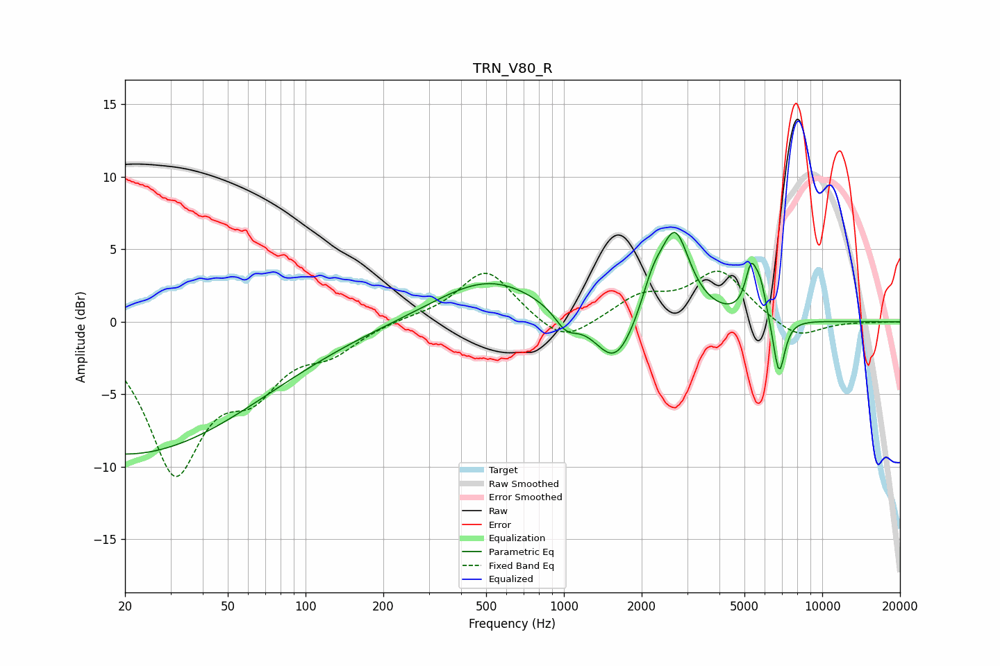

# TRN_V80_R
See [usage instructions](https://github.com/jaakkopasanen/AutoEq#usage) for more options and info.

### Parametric EQs
Apply preamp of -6.3 dB when using parametric equalizer.

|   # | Type    |   Fc (Hz) |    Q |   Gain (dB) |
|-----|---------|-----------|------|-------------|
|   1 | Peaking |        20 | 0.27 |        -9.1 |
|   2 | Peaking |       514 | 0.68 |         3   |
|   3 | Peaking |      1019 | 3.17 |        -1.3 |
|   4 | Peaking |      1379 | 2.09 |         0   |
|   5 | Peaking |      1579 | 1.77 |        -3.7 |
|   6 | Peaking |      2204 | 3.24 |         2   |
|   7 | Peaking |      2695 | 2.44 |         5.9 |
|   8 | Peaking |      5305 | 6    |         3.1 |
|   9 | Peaking |      5776 | 5.88 |         2   |
|  10 | Peaking |      6804 | 6    |        -4.1 |

### Fixed Band EQs
When using fixed band (also called graphic) equalizer, apply preamp of **-3.6 dB** (if available) and set gains manually with these parameters.

|   # | Type    |   Fc (Hz) |    Q |   Gain (dB) |
|-----|---------|-----------|------|-------------|
|   1 | Peaking |        31 | 1.41 |        -9.9 |
|   2 | Peaking |        62 | 1.41 |        -3.6 |
|   3 | Peaking |       125 | 1.41 |        -1.7 |
|   4 | Peaking |       250 | 1.41 |         0.2 |
|   5 | Peaking |       500 | 1.41 |         3.6 |
|   6 | Peaking |      1000 | 1.41 |        -1.7 |
|   7 | Peaking |      2000 | 1.41 |         1.6 |
|   8 | Peaking |      4000 | 1.41 |         3.4 |
|   9 | Peaking |      8000 | 1.41 |        -1.3 |
|  10 | Peaking |     16000 | 1.41 |        -0   |

### Graphs

