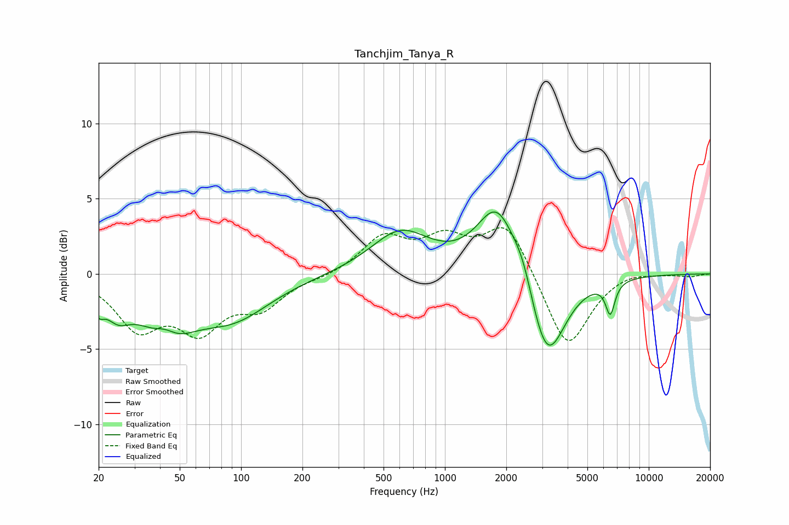

# Tanchjim_Tanya_R
See [usage instructions](https://github.com/jaakkopasanen/AutoEq#usage) for more options and info.

### Parametric EQs
Apply preamp of -4.2 dB when using parametric equalizer.

|   # | Type    |   Fc (Hz) |    Q |   Gain (dB) |
|-----|---------|-----------|------|-------------|
|   1 | Peaking |        20 | 5.37 |        -1.1 |
|   2 | Peaking |        25 | 2.21 |        -1.7 |
|   3 | Peaking |        42 | 2.27 |         1.4 |
|   4 | Peaking |        43 | 1.17 |        -3.8 |
|   5 | Peaking |        92 | 0.75 |        -2.6 |
|   6 | Peaking |       605 | 0.98 |         2.8 |
|   7 | Peaking |      1809 | 1.43 |         4.8 |
|   8 | Peaking |      2418 | 2.88 |         1.4 |
|   9 | Peaking |      3160 | 1.58 |        -6.3 |
|  10 | Peaking |      6475 | 6    |        -2.1 |

### Fixed Band EQs
When using fixed band (also called graphic) equalizer, apply preamp of **-3.2 dB** (if available) and set gains manually with these parameters.

|   # | Type    |   Fc (Hz) |    Q |   Gain (dB) |
|-----|---------|-----------|------|-------------|
|   1 | Peaking |        31 | 1.41 |        -3.3 |
|   2 | Peaking |        62 | 1.41 |        -3.3 |
|   3 | Peaking |       125 | 1.41 |        -2   |
|   4 | Peaking |       250 | 1.41 |        -0.2 |
|   5 | Peaking |       500 | 1.41 |         2.3 |
|   6 | Peaking |      1000 | 1.41 |         2   |
|   7 | Peaking |      2000 | 1.41 |         3.4 |
|   8 | Peaking |      4000 | 1.41 |        -5.1 |
|   9 | Peaking |      8000 | 1.41 |         0.3 |
|  10 | Peaking |     16000 | 1.41 |        -0.2 |

### Graphs

