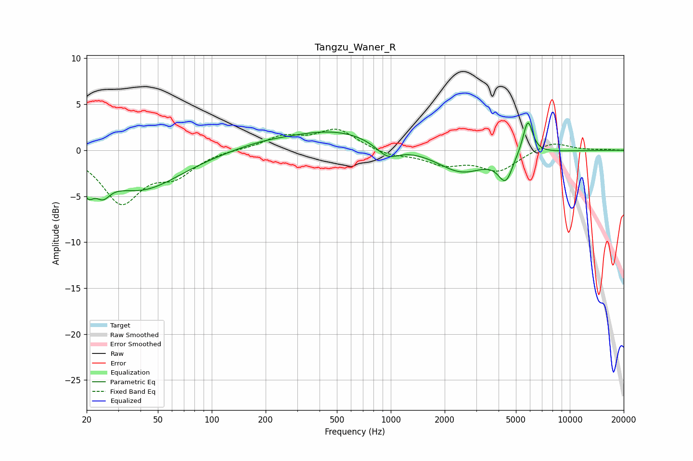

# Tangzu_Waner_R
See [usage instructions](https://github.com/jaakkopasanen/AutoEq#usage) for more options and info.

### Parametric EQs
Apply preamp of -3.1 dB when using parametric equalizer.

|   # | Type    |   Fc (Hz) |    Q |   Gain (dB) |
|-----|---------|-----------|------|-------------|
|   1 | Peaking |        20 | 4.07 |        -2.5 |
|   2 | Peaking |        25 | 3.51 |        -1.8 |
|   3 | Peaking |        40 | 0.64 |        -4.2 |
|   4 | Peaking |       189 | 0.79 |         0.6 |
|   5 | Peaking |       497 | 0.55 |         2.1 |
|   6 | Peaking |       959 | 2.16 |        -1.6 |
|   7 | Peaking |      2480 | 1.05 |        -2.4 |
|   8 | Peaking |      4398 | 3.29 |        -3.1 |
|   9 | Peaking |      4909 | 2.41 |         0.5 |
|  10 | Peaking |      5832 | 5.11 |         3.7 |

### Fixed Band EQs
When using fixed band (also called graphic) equalizer, apply preamp of **-2.4 dB** (if available) and set gains manually with these parameters.

|   # | Type    |   Fc (Hz) |    Q |   Gain (dB) |
|-----|---------|-----------|------|-------------|
|   1 | Peaking |        31 | 1.41 |        -5.5 |
|   2 | Peaking |        62 | 1.41 |        -2.3 |
|   3 | Peaking |       125 | 1.41 |         0.1 |
|   4 | Peaking |       250 | 1.41 |         1.4 |
|   5 | Peaking |       500 | 1.41 |         2.2 |
|   6 | Peaking |      1000 | 1.41 |        -0.6 |
|   7 | Peaking |      2000 | 1.41 |        -1.4 |
|   8 | Peaking |      4000 | 1.41 |        -2.2 |
|   9 | Peaking |      8000 | 1.41 |         1   |
|  10 | Peaking |     16000 | 1.41 |         0.1 |

### Graphs

