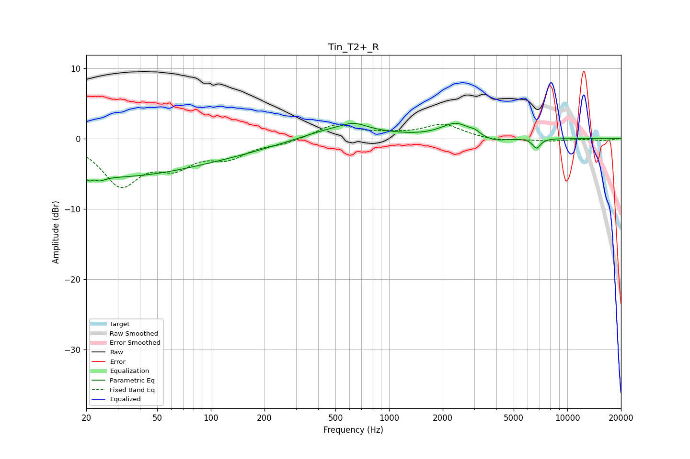

# Tin_T2+_R
See [usage instructions](https://github.com/jaakkopasanen/AutoEq#usage) for more options and info.

### Parametric EQs
Apply preamp of -2.3 dB when using parametric equalizer.

|   # | Type    |   Fc (Hz) |    Q |   Gain (dB) |
|-----|---------|-----------|------|-------------|
|   1 | Peaking |        22 | 4.54 |        -4.1 |
|   2 | Peaking |        22 | 5.93 |         3.2 |
|   3 | Peaking |        26 | 0.36 |        -4.7 |
|   4 | Peaking |       108 | 0.41 |        -1.8 |
|   5 | Peaking |       527 | 0.7  |         1.8 |
|   6 | Peaking |       639 | 2.24 |         0.8 |
|   7 | Peaking |      2379 | 1.73 |         2.1 |
|   8 | Peaking |      3031 | 5.96 |         0.4 |
|   9 | Peaking |      3881 | 2.04 |        -0.7 |
|  10 | Peaking |      6718 | 6    |        -1.4 |

### Fixed Band EQs
When using fixed band (also called graphic) equalizer, apply preamp of **-2.1 dB** (if available) and set gains manually with these parameters.

|   # | Type    |   Fc (Hz) |    Q |   Gain (dB) |
|-----|---------|-----------|------|-------------|
|   1 | Peaking |        31 | 1.41 |        -6.3 |
|   2 | Peaking |        62 | 1.41 |        -3.3 |
|   3 | Peaking |       125 | 1.41 |        -2.3 |
|   4 | Peaking |       250 | 1.41 |        -0.6 |
|   5 | Peaking |       500 | 1.41 |         2   |
|   6 | Peaking |      1000 | 1.41 |         0.5 |
|   7 | Peaking |      2000 | 1.41 |         2   |
|   8 | Peaking |      4000 | 1.41 |        -0.4 |
|   9 | Peaking |      8000 | 1.41 |        -0.3 |
|  10 | Peaking |     16000 | 1.41 |        -0.3 |

### Graphs

