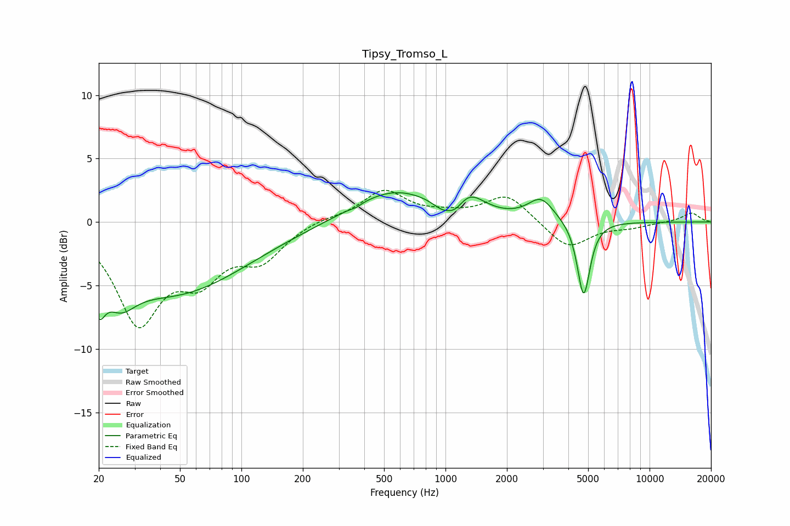

# Tipsy_Tromso_L
See [usage instructions](https://github.com/jaakkopasanen/AutoEq#usage) for more options and info.

### Parametric EQs
Apply preamp of -2.4 dB when using parametric equalizer.

|   # | Type    |   Fc (Hz) |    Q |   Gain (dB) |
|-----|---------|-----------|------|-------------|
|   1 | Peaking |        20 | 4.66 |        -2.9 |
|   2 | Peaking |        25 | 1.95 |        -2.3 |
|   3 | Peaking |        46 | 0.39 |        -5.5 |
|   4 | Peaking |       364 | 5.99 |        -0.2 |
|   5 | Peaking |       555 | 0.69 |         2.5 |
|   6 | Peaking |       962 | 2.89 |        -0.7 |
|   7 | Peaking |      1119 | 3.1  |        -1.1 |
|   8 | Peaking |      1285 | 1.86 |         1.7 |
|   9 | Peaking |      2937 | 2.21 |         1.8 |
|  10 | Peaking |      4753 | 4.52 |        -6   |

### Fixed Band EQs
When using fixed band (also called graphic) equalizer, apply preamp of **-2.6 dB** (if available) and set gains manually with these parameters.

|   # | Type    |   Fc (Hz) |    Q |   Gain (dB) |
|-----|---------|-----------|------|-------------|
|   1 | Peaking |        31 | 1.41 |        -7.6 |
|   2 | Peaking |        62 | 1.41 |        -3.6 |
|   3 | Peaking |       125 | 1.41 |        -2.6 |
|   4 | Peaking |       250 | 1.41 |         0.3 |
|   5 | Peaking |       500 | 1.41 |         2.4 |
|   6 | Peaking |      1000 | 1.41 |         0.4 |
|   7 | Peaking |      2000 | 1.41 |         2.2 |
|   8 | Peaking |      4000 | 1.41 |        -2.1 |
|   9 | Peaking |      8000 | 1.41 |        -0.4 |
|  10 | Peaking |     16000 | 1.41 |         0.7 |

### Graphs

