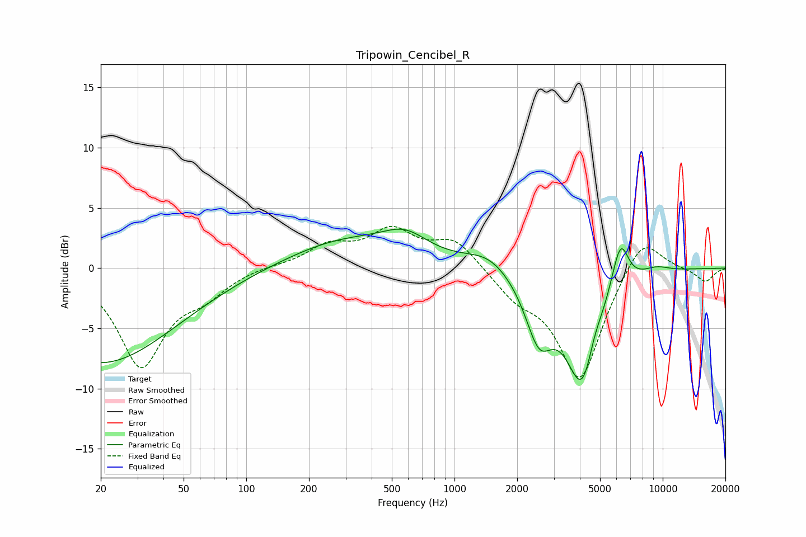

# Tripowin_Cencibel_R
See [usage instructions](https://github.com/jaakkopasanen/AutoEq#usage) for more options and info.

### Parametric EQs
Apply preamp of -3.3 dB when using parametric equalizer.

|   # | Type    |   Fc (Hz) |    Q |   Gain (dB) |
|-----|---------|-----------|------|-------------|
|   1 | Peaking |        20 | 0.4  |        -7.9 |
|   2 | Peaking |       301 | 0.51 |         2.3 |
|   3 | Peaking |       580 | 1.31 |         1.7 |
|   4 | Peaking |      1460 | 1.27 |         1.3 |
|   5 | Peaking |      2544 | 2.13 |        -4.9 |
|   6 | Peaking |      4134 | 1.69 |        -9.7 |
|   7 | Peaking |      4670 | 3.62 |         1.5 |
|   8 | Peaking |      6289 | 3.03 |         4.9 |
|   9 | Peaking |      6746 | 2.74 |        -0.8 |
|  10 | Peaking |      9302 | 1.94 |         0.5 |

### Fixed Band EQs
When using fixed band (also called graphic) equalizer, apply preamp of **-3.6 dB** (if available) and set gains manually with these parameters.

|   # | Type    |   Fc (Hz) |    Q |   Gain (dB) |
|-----|---------|-----------|------|-------------|
|   1 | Peaking |        31 | 1.41 |        -8   |
|   2 | Peaking |        62 | 1.41 |        -1.7 |
|   3 | Peaking |       125 | 1.41 |         0.2 |
|   4 | Peaking |       250 | 1.41 |         1.7 |
|   5 | Peaking |       500 | 1.41 |         2.9 |
|   6 | Peaking |      1000 | 1.41 |         2.3 |
|   7 | Peaking |      2000 | 1.41 |        -1.9 |
|   8 | Peaking |      4000 | 1.41 |        -9.3 |
|   9 | Peaking |      8000 | 1.41 |         3.1 |
|  10 | Peaking |     16000 | 1.41 |        -1.1 |

### Graphs

