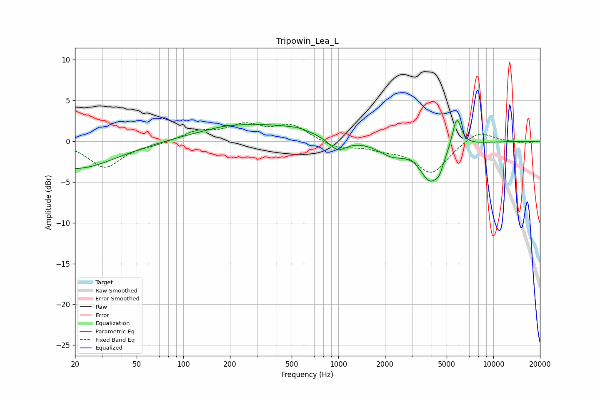

# Tripowin_Lea_L
See [usage instructions](https://github.com/jaakkopasanen/AutoEq#usage) for more options and info.

### Parametric EQs
Apply preamp of -2.6 dB when using parametric equalizer.

|   # | Type    |   Fc (Hz) |    Q |   Gain (dB) |
|-----|---------|-----------|------|-------------|
|   1 | Peaking |        20 | 0.54 |        -3.4 |
|   2 | Peaking |       178 | 2.81 |         0.1 |
|   3 | Peaking |       279 | 0.42 |         2.1 |
|   4 | Peaking |       549 | 2.03 |         0.3 |
|   5 | Peaking |       987 | 2.52 |        -1.6 |
|   6 | Peaking |      2214 | 1.65 |        -1.5 |
|   7 | Peaking |      3971 | 2.04 |        -4.8 |
|   8 | Peaking |      4038 | 6    |         0.2 |
|   9 | Peaking |      4497 | 5.99 |        -0.8 |
|  10 | Peaking |      5804 | 4.61 |         3.9 |

### Fixed Band EQs
When using fixed band (also called graphic) equalizer, apply preamp of **-2.4 dB** (if available) and set gains manually with these parameters.

|   # | Type    |   Fc (Hz) |    Q |   Gain (dB) |
|-----|---------|-----------|------|-------------|
|   1 | Peaking |        31 | 1.41 |        -3.2 |
|   2 | Peaking |        62 | 1.41 |        -0.3 |
|   3 | Peaking |       125 | 1.41 |         1.1 |
|   4 | Peaking |       250 | 1.41 |         1.8 |
|   5 | Peaking |       500 | 1.41 |         1.9 |
|   6 | Peaking |      1000 | 1.41 |        -0.9 |
|   7 | Peaking |      2000 | 1.41 |        -0.7 |
|   8 | Peaking |      4000 | 1.41 |        -3.9 |
|   9 | Peaking |      8000 | 1.41 |         1.4 |
|  10 | Peaking |     16000 | 1.41 |        -0.3 |

### Graphs

