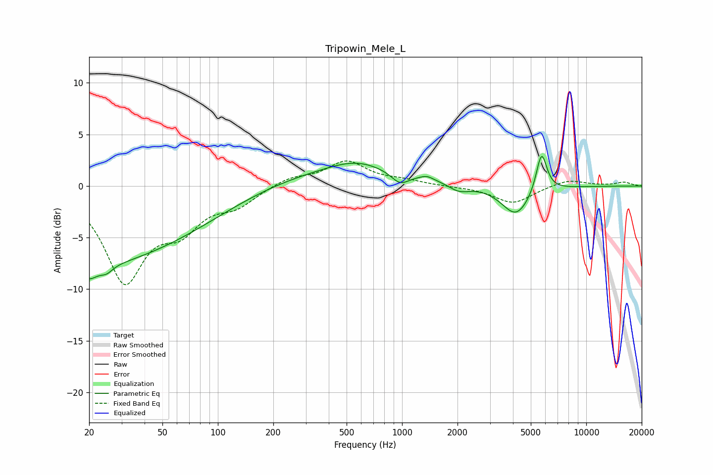

# Tripowin_Mele_L
See [usage instructions](https://github.com/jaakkopasanen/AutoEq#usage) for more options and info.

### Parametric EQs
Apply preamp of -3.0 dB when using parametric equalizer.

|   # | Type    |   Fc (Hz) |    Q |   Gain (dB) |
|-----|---------|-----------|------|-------------|
|   1 | Peaking |        20 | 3.22 |        -1.2 |
|   2 | Peaking |        21 | 0.18 |        -8.1 |
|   3 | Peaking |        25 | 4.33 |        -0.6 |
|   4 | Peaking |       223 | 0.18 |         1.9 |
|   5 | Peaking |       561 | 0.96 |         1.1 |
|   6 | Peaking |       974 | 2.92 |        -1.1 |
|   7 | Peaking |      1364 | 3.88 |         0.4 |
|   8 | Peaking |      2036 | 2.44 |        -0.8 |
|   9 | Peaking |      4161 | 1.79 |        -2.9 |
|  10 | Peaking |      5717 | 4.74 |         4   |

### Fixed Band EQs
When using fixed band (also called graphic) equalizer, apply preamp of **-2.5 dB** (if available) and set gains manually with these parameters.

|   # | Type    |   Fc (Hz) |    Q |   Gain (dB) |
|-----|---------|-----------|------|-------------|
|   1 | Peaking |        31 | 1.41 |        -8.9 |
|   2 | Peaking |        62 | 1.41 |        -3.3 |
|   3 | Peaking |       125 | 1.41 |        -1.6 |
|   4 | Peaking |       250 | 1.41 |         0.8 |
|   5 | Peaking |       500 | 1.41 |         2.3 |
|   6 | Peaking |      1000 | 1.41 |         0.4 |
|   7 | Peaking |      2000 | 1.41 |        -0   |
|   8 | Peaking |      4000 | 1.41 |        -1.7 |
|   9 | Peaking |      8000 | 1.41 |         0.7 |
|  10 | Peaking |     16000 | 1.41 |         0.4 |

### Graphs

