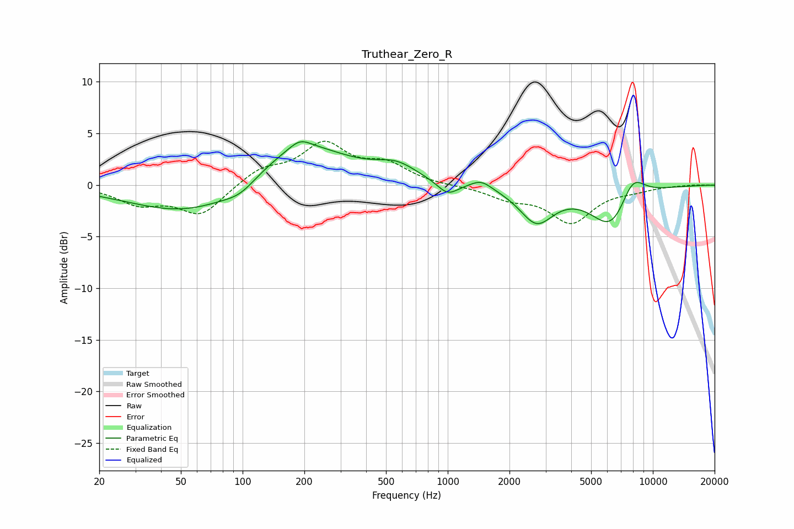

# Truthear_Zero_R
See [usage instructions](https://github.com/jaakkopasanen/AutoEq#usage) for more options and info.

### Parametric EQs
Apply preamp of -4.3 dB when using parametric equalizer.

|   # | Type    |   Fc (Hz) |    Q |   Gain (dB) |
|-----|---------|-----------|------|-------------|
|   1 | Peaking |        59 | 0.48 |        -3.1 |
|   2 | Peaking |        98 | 1.83 |        -0.9 |
|   3 | Peaking |       186 | 0.6  |         4.4 |
|   4 | Peaking |       190 | 2.81 |         0.9 |
|   5 | Peaking |       564 | 1.42 |         1.4 |
|   6 | Peaking |       999 | 2.76 |        -1.3 |
|   7 | Peaking |      1457 | 2.83 |         0.8 |
|   8 | Peaking |      2709 | 1.71 |        -3.4 |
|   9 | Peaking |      6348 | 1.35 |        -4.4 |
|  10 | Peaking |      7913 | 2.1  |         3   |

### Fixed Band EQs
When using fixed band (also called graphic) equalizer, apply preamp of **-4.3 dB** (if available) and set gains manually with these parameters.

|   # | Type    |   Fc (Hz) |    Q |   Gain (dB) |
|-----|---------|-----------|------|-------------|
|   1 | Peaking |        31 | 1.41 |        -1.7 |
|   2 | Peaking |        62 | 1.41 |        -2.9 |
|   3 | Peaking |       125 | 1.41 |         1.5 |
|   4 | Peaking |       250 | 1.41 |         3.8 |
|   5 | Peaking |       500 | 1.41 |         1.8 |
|   6 | Peaking |      1000 | 1.41 |        -0.1 |
|   7 | Peaking |      2000 | 1.41 |        -1.1 |
|   8 | Peaking |      4000 | 1.41 |        -3.5 |
|   9 | Peaking |      8000 | 1.41 |        -0.4 |
|  10 | Peaking |     16000 | 1.41 |         0   |

### Graphs

