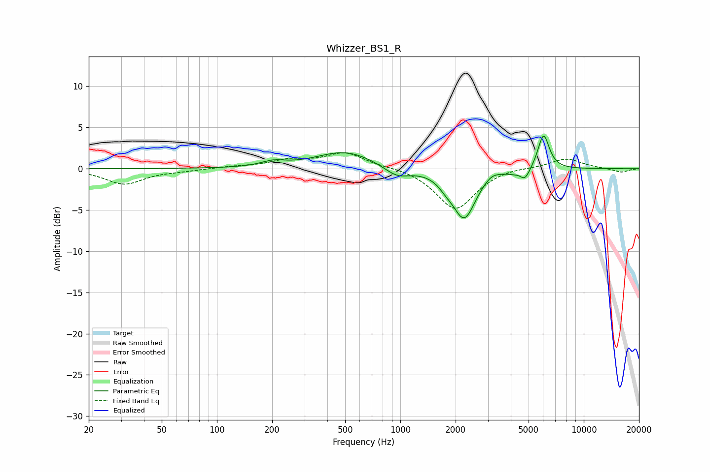

# Whizzer_BS1_R
See [usage instructions](https://github.com/jaakkopasanen/AutoEq#usage) for more options and info.

### Parametric EQs
Apply preamp of -4.0 dB when using parametric equalizer.

|   # | Type    |   Fc (Hz) |    Q |   Gain (dB) |
|-----|---------|-----------|------|-------------|
|   1 | Peaking |       203 | 2.17 |         0.6 |
|   2 | Peaking |       501 | 0.9  |         2.1 |
|   3 | Peaking |       959 | 2.01 |        -1.3 |
|   4 | Peaking |      1772 | 3.54 |        -0.7 |
|   5 | Peaking |      2229 | 2.24 |        -5.9 |
|   6 | Peaking |      3147 | 3.26 |         0.6 |
|   7 | Peaking |      4413 | 6    |         0.8 |
|   8 | Peaking |      4427 | 4.53 |        -1.1 |
|   9 | Peaking |      4799 | 5.2  |        -1.1 |
|  10 | Peaking |      6036 | 4.44 |         4.3 |

### Fixed Band EQs
When using fixed band (also called graphic) equalizer, apply preamp of **-2.0 dB** (if available) and set gains manually with these parameters.

|   # | Type    |   Fc (Hz) |    Q |   Gain (dB) |
|-----|---------|-----------|------|-------------|
|   1 | Peaking |        31 | 1.41 |        -1.9 |
|   2 | Peaking |        62 | 1.41 |        -0.2 |
|   3 | Peaking |       125 | 1.41 |         0.2 |
|   4 | Peaking |       250 | 1.41 |         0.9 |
|   5 | Peaking |       500 | 1.41 |         1.9 |
|   6 | Peaking |      1000 | 1.41 |         0.2 |
|   7 | Peaking |      2000 | 1.41 |        -5   |
|   8 | Peaking |      4000 | 1.41 |         0.3 |
|   9 | Peaking |      8000 | 1.41 |         1.3 |
|  10 | Peaking |     16000 | 1.41 |        -0.5 |

### Graphs

