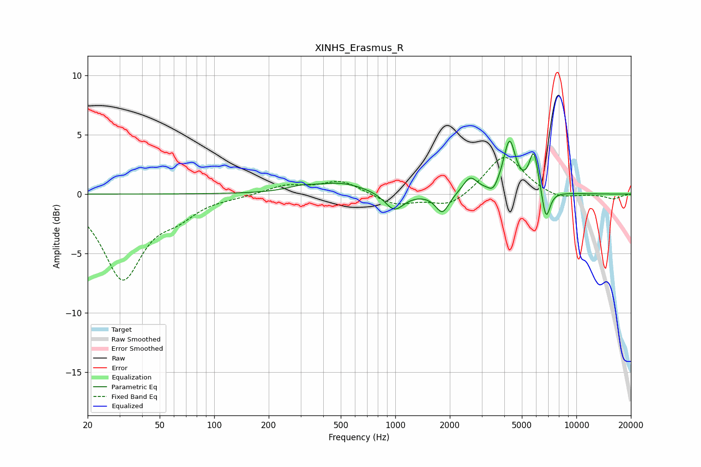

# XINHS_Erasmus_R
See [usage instructions](https://github.com/jaakkopasanen/AutoEq#usage) for more options and info.

### Parametric EQs
Apply preamp of -4.6 dB when using parametric equalizer.

|   # | Type    |   Fc (Hz) |    Q |   Gain (dB) |
|-----|---------|-----------|------|-------------|
|   1 | Peaking |       298 | 1.89 |         0.3 |
|   2 | Peaking |       499 | 0.97 |         0.9 |
|   3 | Peaking |       987 | 2.69 |        -1.5 |
|   4 | Peaking |      1819 | 3.81 |        -1.7 |
|   5 | Peaking |      2589 | 3.58 |         1.4 |
|   6 | Peaking |      3471 | 5.59 |        -0.7 |
|   7 | Peaking |      4271 | 4.23 |         4.3 |
|   8 | Peaking |      5812 | 5.75 |         2.5 |
|   9 | Peaking |      5863 | 4.37 |         0.9 |
|  10 | Peaking |      6793 | 6    |        -2.7 |

### Fixed Band EQs
When using fixed band (also called graphic) equalizer, apply preamp of **-3.2 dB** (if available) and set gains manually with these parameters.

|   # | Type    |   Fc (Hz) |    Q |   Gain (dB) |
|-----|---------|-----------|------|-------------|
|   1 | Peaking |        31 | 1.41 |        -7   |
|   2 | Peaking |        62 | 1.41 |        -1.4 |
|   3 | Peaking |       125 | 1.41 |        -0.1 |
|   4 | Peaking |       250 | 1.41 |         0.7 |
|   5 | Peaking |       500 | 1.41 |         1.1 |
|   6 | Peaking |      1000 | 1.41 |        -0.9 |
|   7 | Peaking |      2000 | 1.41 |        -1.1 |
|   8 | Peaking |      4000 | 1.41 |         3.4 |
|   9 | Peaking |      8000 | 1.41 |        -0.5 |
|  10 | Peaking |     16000 | 1.41 |        -0.4 |

### Graphs

