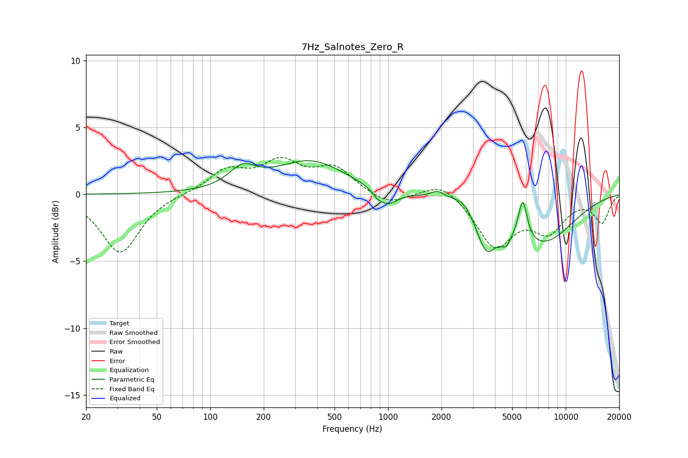

# 7Hz_Salnotes_Zero_R
See [usage instructions](https://github.com/jaakkopasanen/AutoEq#usage) for more options and info.

### Parametric EQs
Apply preamp of -2.6 dB when using parametric equalizer.

|   # | Type    |   Fc (Hz) |    Q |   Gain (dB) |
|-----|---------|-----------|------|-------------|
|   1 | Peaking |       152 | 1.84 |         1.5 |
|   2 | Peaking |       367 | 0.72 |         2.5 |
|   3 | Peaking |       870 | 6    |        -0.3 |
|   4 | Peaking |       992 | 2.55 |        -1.2 |
|   5 | Peaking |      1900 | 3.72 |         0.5 |
|   6 | Peaking |      2681 | 2.09 |         0.9 |
|   7 | Peaking |      3572 | 2.38 |        -3.1 |
|   8 | Peaking |      4609 | 4.78 |        -1   |
|   9 | Peaking |      5735 | 5.69 |         3   |
|  10 | Peaking |      7259 | 0.72 |        -3.6 |

### Fixed Band EQs
When using fixed band (also called graphic) equalizer, apply preamp of **-2.9 dB** (if available) and set gains manually with these parameters.

|   # | Type    |   Fc (Hz) |    Q |   Gain (dB) |
|-----|---------|-----------|------|-------------|
|   1 | Peaking |        31 | 1.41 |        -4.4 |
|   2 | Peaking |        62 | 1.41 |         0   |
|   3 | Peaking |       125 | 1.41 |         1.7 |
|   4 | Peaking |       250 | 1.41 |         2.2 |
|   5 | Peaking |       500 | 1.41 |         1.9 |
|   6 | Peaking |      1000 | 1.41 |        -0.9 |
|   7 | Peaking |      2000 | 1.41 |         1.1 |
|   8 | Peaking |      4000 | 1.41 |        -3.8 |
|   9 | Peaking |      8000 | 1.41 |        -2.5 |
|  10 | Peaking |     16000 | 1.41 |        -2   |

### Graphs

