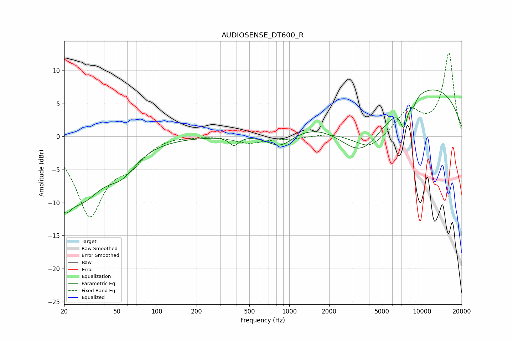

# AUDIOSENSE_DT600_R
See [usage instructions](https://github.com/jaakkopasanen/AutoEq#usage) for more options and info.

### Parametric EQs
Apply preamp of -7.2 dB when using parametric equalizer.

|   # | Type    |   Fc (Hz) |    Q |   Gain (dB) |
|-----|---------|-----------|------|-------------|
|   1 | Peaking |        20 | 3.1  |        -1.6 |
|   2 | Peaking |        20 | 2.7  |        -2.8 |
|   3 | Peaking |        27 | 0.83 |        -8.4 |
|   4 | Peaking |        55 | 1.3  |        -3.1 |
|   5 | Peaking |       383 | 3.98 |        -1.4 |
|   6 | Peaking |       855 | 1.34 |        -2.7 |
|   7 | Peaking |      3522 | 0.64 |       -10.5 |
|   8 | Peaking |      6595 | 0.18 |         9.7 |
|   9 | Peaking |      7326 | 5    |        -3.6 |
|  10 | Peaking |      8670 | 6    |        -1.1 |

### Fixed Band EQs
When using fixed band (also called graphic) equalizer, apply preamp of **-12.8 dB** (if available) and set gains manually with these parameters.

|   # | Type    |   Fc (Hz) |    Q |   Gain (dB) |
|-----|---------|-----------|------|-------------|
|   1 | Peaking |        31 | 1.41 |       -11.6 |
|   2 | Peaking |        62 | 1.41 |        -3.1 |
|   3 | Peaking |       125 | 1.41 |         0.3 |
|   4 | Peaking |       250 | 1.41 |         0.2 |
|   5 | Peaking |       500 | 1.41 |        -1   |
|   6 | Peaking |      1000 | 1.41 |        -0.3 |
|   7 | Peaking |      2000 | 1.41 |         0.5 |
|   8 | Peaking |      4000 | 1.41 |        -2   |
|   9 | Peaking |      8000 | 1.41 |         3.8 |
|  10 | Peaking |     16000 | 1.41 |        12.6 |

### Graphs

