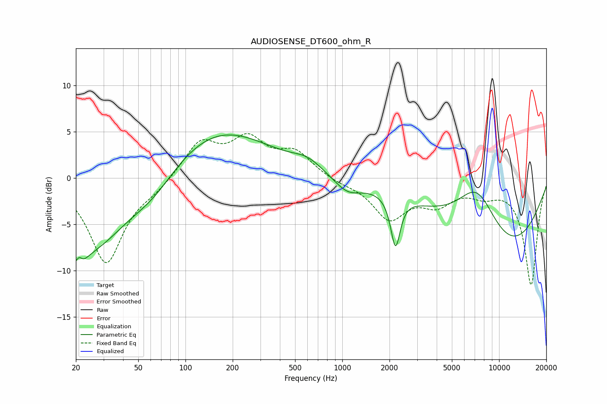

# AUDIOSENSE_DT600_ohm_R
See [usage instructions](https://github.com/jaakkopasanen/AutoEq#usage) for more options and info.

### Parametric EQs
Apply preamp of -4.8 dB when using parametric equalizer.

|   # | Type    |   Fc (Hz) |    Q |   Gain (dB) |
|-----|---------|-----------|------|-------------|
|   1 | Peaking |        20 | 3.3  |        -6   |
|   2 | Peaking |        21 | 5.55 |         3.3 |
|   3 | Peaking |        26 | 0.68 |        -6.9 |
|   4 | Peaking |        62 | 0.86 |        -2.6 |
|   5 | Peaking |       157 | 0.41 |         5.5 |
|   6 | Peaking |       601 | 1.51 |         1.1 |
|   7 | Peaking |      1079 | 1.6  |        -1.6 |
|   8 | Peaking |      2184 | 4.73 |        -5.5 |
|   9 | Peaking |      7244 | 0.96 |         6.9 |
|  10 | Peaking |      9436 | 0.35 |        -9.2 |

### Fixed Band EQs
When using fixed band (also called graphic) equalizer, apply preamp of **-4.9 dB** (if available) and set gains manually with these parameters.

|   # | Type    |   Fc (Hz) |    Q |   Gain (dB) |
|-----|---------|-----------|------|-------------|
|   1 | Peaking |        31 | 1.41 |        -9.1 |
|   2 | Peaking |        62 | 1.41 |        -0.9 |
|   3 | Peaking |       125 | 1.41 |         3.8 |
|   4 | Peaking |       250 | 1.41 |         3.8 |
|   5 | Peaking |       500 | 1.41 |         2.6 |
|   6 | Peaking |      1000 | 1.41 |        -0.4 |
|   7 | Peaking |      2000 | 1.41 |        -4.2 |
|   8 | Peaking |      4000 | 1.41 |        -2.4 |
|   9 | Peaking |      8000 | 1.41 |        -1.3 |
|  10 | Peaking |     16000 | 1.41 |       -11.5 |

### Graphs

