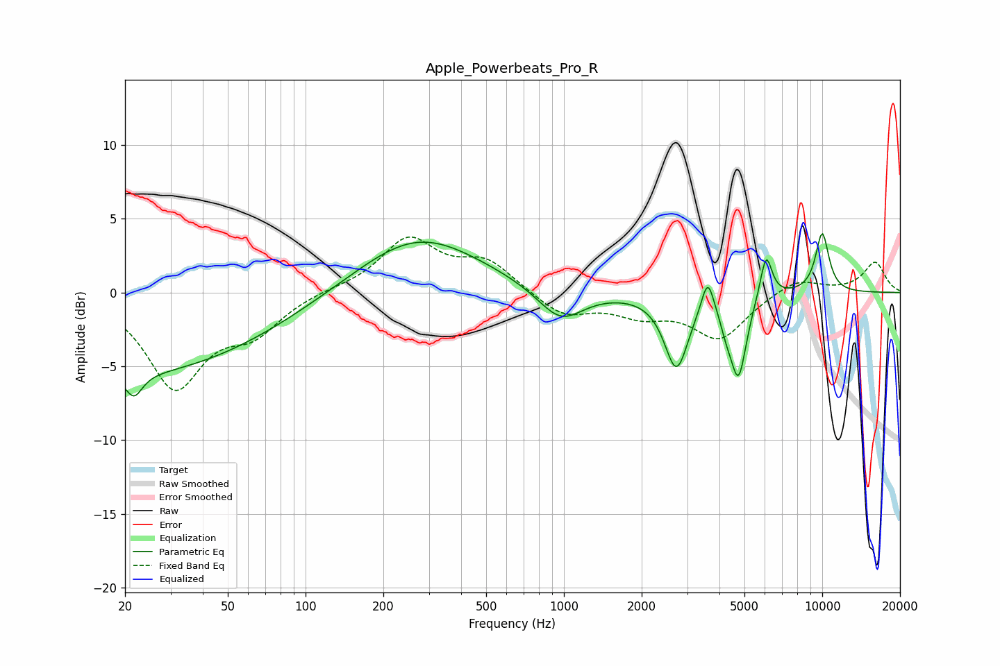

# Apple_Powerbeats_Pro_R
See [usage instructions](https://github.com/jaakkopasanen/AutoEq#usage) for more options and info.

### Parametric EQs
Apply preamp of -4.1 dB when using parametric equalizer.

|   # | Type    |   Fc (Hz) |    Q |   Gain (dB) |
|-----|---------|-----------|------|-------------|
|   1 | Peaking |        20 | 0.25 |        -5.5 |
|   2 | Peaking |        22 | 4.42 |        -1.6 |
|   3 | Peaking |       272 | 0.59 |         4   |
|   4 | Peaking |       971 | 1.59 |        -2.3 |
|   5 | Peaking |      2727 | 3.09 |        -5   |
|   6 | Peaking |      3602 | 5.93 |         2.4 |
|   7 | Peaking |      4246 | 5.98 |        -1   |
|   8 | Peaking |      4739 | 4.45 |        -5.4 |
|   9 | Peaking |      6063 | 6    |         3   |
|  10 | Peaking |     10000 | 4.58 |         4   |

### Fixed Band EQs
When using fixed band (also called graphic) equalizer, apply preamp of **-3.9 dB** (if available) and set gains manually with these parameters.

|   # | Type    |   Fc (Hz) |    Q |   Gain (dB) |
|-----|---------|-----------|------|-------------|
|   1 | Peaking |        31 | 1.41 |        -6.2 |
|   2 | Peaking |        62 | 1.41 |        -2.3 |
|   3 | Peaking |       125 | 1.41 |         0.2 |
|   4 | Peaking |       250 | 1.41 |         3.5 |
|   5 | Peaking |       500 | 1.41 |         2   |
|   6 | Peaking |      1000 | 1.41 |        -1.6 |
|   7 | Peaking |      2000 | 1.41 |        -1.3 |
|   8 | Peaking |      4000 | 1.41 |        -3   |
|   9 | Peaking |      8000 | 1.41 |         1   |
|  10 | Peaking |     16000 | 1.41 |         2   |

### Graphs

