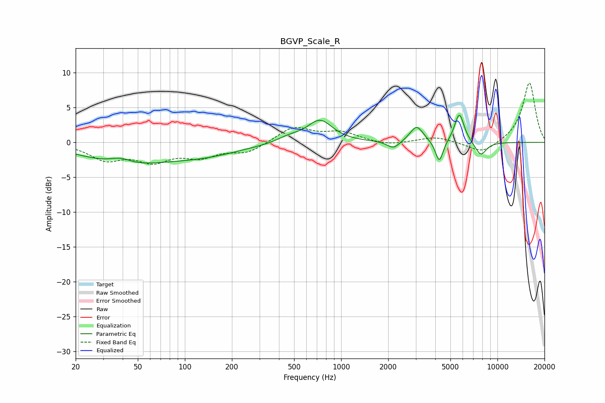

# BGVP_Scale_R
See [usage instructions](https://github.com/jaakkopasanen/AutoEq#usage) for more options and info.

### Parametric EQs
Apply preamp of -4.0 dB when using parametric equalizer.

|   # | Type    |   Fc (Hz) |    Q |   Gain (dB) |
|-----|---------|-----------|------|-------------|
|   1 | Peaking |        39 | 2.1  |         0.9 |
|   2 | Peaking |        41 | 0.54 |        -2.9 |
|   3 | Peaking |       132 | 0.58 |        -1.5 |
|   4 | Peaking |       465 | 1.84 |         0.7 |
|   5 | Peaking |       731 | 1.77 |         3.2 |
|   6 | Peaking |      2163 | 3.54 |        -1.1 |
|   7 | Peaking |      3039 | 3.38 |         2.3 |
|   8 | Peaking |      4245 | 5.73 |        -3.2 |
|   9 | Peaking |      5706 | 4.49 |         4.3 |
|  10 | Peaking |      7818 | 3.63 |        -2   |

### Fixed Band EQs
When using fixed band (also called graphic) equalizer, apply preamp of **-8.6 dB** (if available) and set gains manually with these parameters.

|   # | Type    |   Fc (Hz) |    Q |   Gain (dB) |
|-----|---------|-----------|------|-------------|
|   1 | Peaking |        31 | 1.41 |        -2.3 |
|   2 | Peaking |        62 | 1.41 |        -2.4 |
|   3 | Peaking |       125 | 1.41 |        -1.8 |
|   4 | Peaking |       250 | 1.41 |        -1.4 |
|   5 | Peaking |       500 | 1.41 |         2.2 |
|   6 | Peaking |      1000 | 1.41 |         1.3 |
|   7 | Peaking |      2000 | 1.41 |        -0.5 |
|   8 | Peaking |      4000 | 1.41 |         0.8 |
|   9 | Peaking |      8000 | 1.41 |        -1.7 |
|  10 | Peaking |     16000 | 1.41 |         8.6 |

### Graphs

