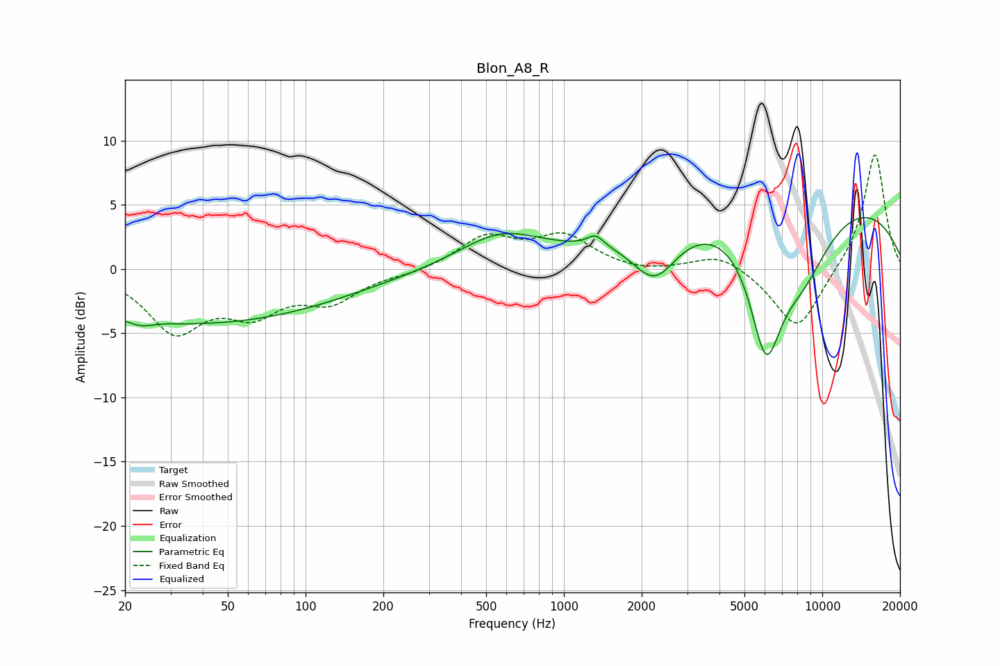

# Blon_A8_R
See [usage instructions](https://github.com/jaakkopasanen/AutoEq#usage) for more options and info.

### Parametric EQs
Apply preamp of -4.1 dB when using parametric equalizer.

|   # | Type    |   Fc (Hz) |    Q |   Gain (dB) |
|-----|---------|-----------|------|-------------|
|   1 | Peaking |        23 | 3.01 |        -0.5 |
|   2 | Peaking |        30 | 5.78 |         3.1 |
|   3 | Peaking |        30 | 5.75 |        -3.1 |
|   4 | Peaking |        38 | 0.25 |        -4.2 |
|   5 | Peaking |       568 | 0.86 |         2.6 |
|   6 | Peaking |      1327 | 4.37 |         0.9 |
|   7 | Peaking |      2247 | 1.61 |        -3.9 |
|   8 | Peaking |      6052 | 2.12 |        -9.4 |
|   9 | Peaking |      8117 | 0.2  |         6.2 |
|  10 | Peaking |      8305 | 1.09 |        -5.3 |

### Fixed Band EQs
When using fixed band (also called graphic) equalizer, apply preamp of **-9.0 dB** (if available) and set gains manually with these parameters.

|   # | Type    |   Fc (Hz) |    Q |   Gain (dB) |
|-----|---------|-----------|------|-------------|
|   1 | Peaking |        31 | 1.41 |        -4.6 |
|   2 | Peaking |        62 | 1.41 |        -2.9 |
|   3 | Peaking |       125 | 1.41 |        -2.3 |
|   4 | Peaking |       250 | 1.41 |        -0.3 |
|   5 | Peaking |       500 | 1.41 |         2.4 |
|   6 | Peaking |      1000 | 1.41 |         2.4 |
|   7 | Peaking |      2000 | 1.41 |        -0.3 |
|   8 | Peaking |      4000 | 1.41 |         1.3 |
|   9 | Peaking |      8000 | 1.41 |        -4.9 |
|  10 | Peaking |     16000 | 1.41 |         9.2 |

### Graphs

