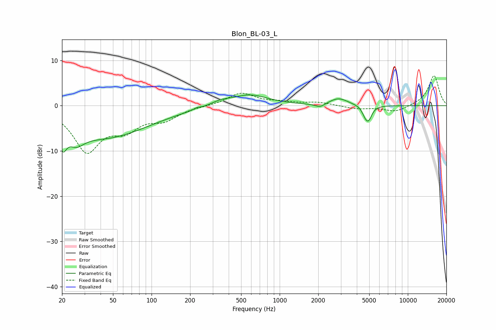

# Blon_BL-03_L
See [usage instructions](https://github.com/jaakkopasanen/AutoEq#usage) for more options and info.

### Parametric EQs
Apply preamp of -2.5 dB when using parametric equalizer.

|   # | Type    |   Fc (Hz) |    Q |   Gain (dB) |
|-----|---------|-----------|------|-------------|
|   1 | Peaking |        20 | 4.98 |        -4.2 |
|   2 | Peaking |        26 | 2.37 |        -2.8 |
|   3 | Peaking |        43 | 0.4  |        -6.9 |
|   4 | Peaking |       226 | 5.99 |         0.3 |
|   5 | Peaking |       343 | 1.92 |         0.8 |
|   6 | Peaking |       582 | 0.98 |         2.5 |
|   7 | Peaking |      2066 | 3.66 |        -0.9 |
|   8 | Peaking |      2884 | 1.96 |         1.6 |
|   9 | Peaking |      4636 | 5.96 |        -1.3 |
|  10 | Peaking |      4940 | 5.41 |        -2.8 |

### Fixed Band EQs
When using fixed band (also called graphic) equalizer, apply preamp of **-6.7 dB** (if available) and set gains manually with these parameters.

|   # | Type    |   Fc (Hz) |    Q |   Gain (dB) |
|-----|---------|-----------|------|-------------|
|   1 | Peaking |        31 | 1.41 |        -9.7 |
|   2 | Peaking |        62 | 1.41 |        -4.2 |
|   3 | Peaking |       125 | 1.41 |        -2.7 |
|   4 | Peaking |       250 | 1.41 |        -0.1 |
|   5 | Peaking |       500 | 1.41 |         2.8 |
|   6 | Peaking |      1000 | 1.41 |         0.6 |
|   7 | Peaking |      2000 | 1.41 |         0.7 |
|   8 | Peaking |      4000 | 1.41 |        -0.7 |
|   9 | Peaking |      8000 | 1.41 |        -1.4 |
|  10 | Peaking |     16000 | 1.41 |         6.7 |

### Graphs

