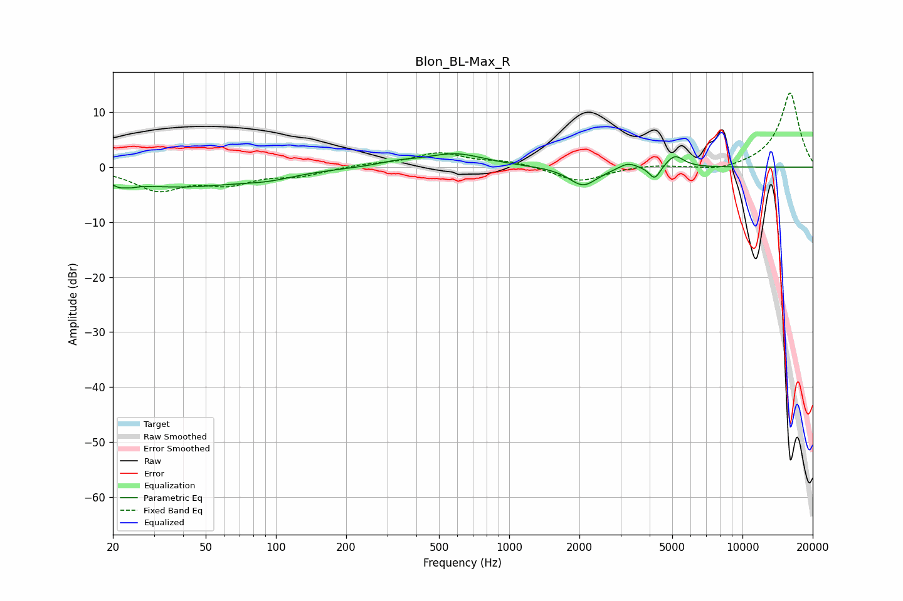

# Blon_BL-Max_R
See [usage instructions](https://github.com/jaakkopasanen/AutoEq#usage) for more options and info.

### Parametric EQs
Apply preamp of -2.5 dB when using parametric equalizer.

|   # | Type    |   Fc (Hz) |    Q |   Gain (dB) |
|-----|---------|-----------|------|-------------|
|   1 | Peaking |        22 | 4.79 |        -3.5 |
|   2 | Peaking |        22 | 6    |         2.4 |
|   3 | Peaking |        38 | 0.49 |        -3.4 |
|   4 | Peaking |        93 | 1.26 |        -0.9 |
|   5 | Peaking |       332 | 1.76 |         0.7 |
|   6 | Peaking |       587 | 1.12 |         2.4 |
|   7 | Peaking |      2076 | 2.32 |        -3.5 |
|   8 | Peaking |      3225 | 3.76 |         1.1 |
|   9 | Peaking |      4206 | 5.86 |        -2.5 |
|  10 | Peaking |      5128 | 3.67 |         2.3 |

### Fixed Band EQs
When using fixed band (also called graphic) equalizer, apply preamp of **-13.6 dB** (if available) and set gains manually with these parameters.

|   # | Type    |   Fc (Hz) |    Q |   Gain (dB) |
|-----|---------|-----------|------|-------------|
|   1 | Peaking |        31 | 1.41 |        -4   |
|   2 | Peaking |        62 | 1.41 |        -2.6 |
|   3 | Peaking |       125 | 1.41 |        -1.4 |
|   4 | Peaking |       250 | 1.41 |         0.5 |
|   5 | Peaking |       500 | 1.41 |         2.5 |
|   6 | Peaking |      1000 | 1.41 |         1   |
|   7 | Peaking |      2000 | 1.41 |        -2.7 |
|   8 | Peaking |      4000 | 1.41 |         0.5 |
|   9 | Peaking |      8000 | 1.41 |        -0.9 |
|  10 | Peaking |     16000 | 1.41 |        13.6 |

### Graphs

