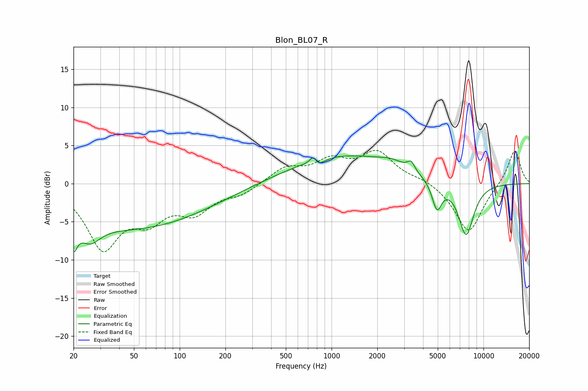

# Blon_BL07_R
See [usage instructions](https://github.com/jaakkopasanen/AutoEq#usage) for more options and info.

### Parametric EQs
Apply preamp of -3.7 dB when using parametric equalizer.

|   # | Type    |   Fc (Hz) |    Q |   Gain (dB) |
|-----|---------|-----------|------|-------------|
|   1 | Peaking |        20 | 5.8  |        -3.4 |
|   2 | Peaking |        26 | 2.09 |        -2.6 |
|   3 | Peaking |        49 | 0.28 |        -5.8 |
|   4 | Peaking |       761 | 5.78 |         1.5 |
|   5 | Peaking |       798 | 3.75 |        -1.3 |
|   6 | Peaking |      1179 | 0.4  |         3.7 |
|   7 | Peaking |      2490 | 1.61 |         0.8 |
|   8 | Peaking |      3337 | 5.92 |         1.2 |
|   9 | Peaking |      4941 | 4.34 |        -3.7 |
|  10 | Peaking |      7685 | 2.54 |        -7   |

### Fixed Band EQs
When using fixed band (also called graphic) equalizer, apply preamp of **-4.5 dB** (if available) and set gains manually with these parameters.

|   # | Type    |   Fc (Hz) |    Q |   Gain (dB) |
|-----|---------|-----------|------|-------------|
|   1 | Peaking |        31 | 1.41 |        -8.1 |
|   2 | Peaking |        62 | 1.41 |        -3.8 |
|   3 | Peaking |       125 | 1.41 |        -3.3 |
|   4 | Peaking |       250 | 1.41 |        -1.2 |
|   5 | Peaking |       500 | 1.41 |         2   |
|   6 | Peaking |      1000 | 1.41 |         2.7 |
|   7 | Peaking |      2000 | 1.41 |         3.9 |
|   8 | Peaking |      4000 | 1.41 |         0.6 |
|   9 | Peaking |      8000 | 1.41 |        -6.5 |
|  10 | Peaking |     16000 | 1.41 |         4.6 |

### Graphs

