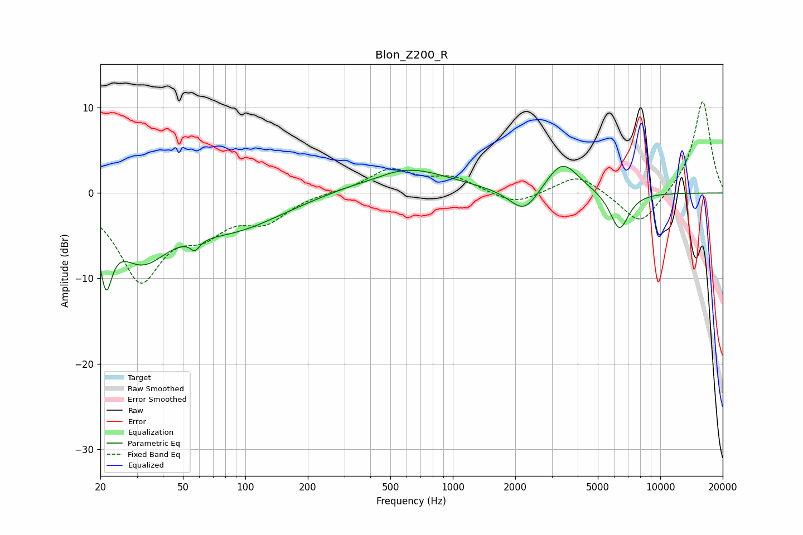

# Blon_Z200_R
See [usage instructions](https://github.com/jaakkopasanen/AutoEq#usage) for more options and info.

### Parametric EQs
Apply preamp of -3.2 dB when using parametric equalizer.

|   # | Type    |   Fc (Hz) |    Q |   Gain (dB) |
|-----|---------|-----------|------|-------------|
|   1 | Peaking |        21 | 4.95 |        -6.9 |
|   2 | Peaking |        32 | 1.07 |        -6.7 |
|   3 | Peaking |        56 | 5.51 |         3.4 |
|   4 | Peaking |        57 | 5.59 |        -4.7 |
|   5 | Peaking |        87 | 0.58 |        -3.8 |
|   6 | Peaking |       422 | 1.36 |        -0.5 |
|   7 | Peaking |       567 | 0.66 |         3.2 |
|   8 | Peaking |      2211 | 1.99 |        -3   |
|   9 | Peaking |      3368 | 1.76 |         3.9 |
|  10 | Peaking |      6357 | 3    |        -4.5 |

### Fixed Band EQs
When using fixed band (also called graphic) equalizer, apply preamp of **-10.8 dB** (if available) and set gains manually with these parameters.

|   # | Type    |   Fc (Hz) |    Q |   Gain (dB) |
|-----|---------|-----------|------|-------------|
|   1 | Peaking |        31 | 1.41 |        -9.8 |
|   2 | Peaking |        62 | 1.41 |        -3.5 |
|   3 | Peaking |       125 | 1.41 |        -2.9 |
|   4 | Peaking |       250 | 1.41 |         0.1 |
|   5 | Peaking |       500 | 1.41 |         2.7 |
|   6 | Peaking |      1000 | 1.41 |         1.7 |
|   7 | Peaking |      2000 | 1.41 |        -1.5 |
|   8 | Peaking |      4000 | 1.41 |         2.3 |
|   9 | Peaking |      8000 | 1.41 |        -4   |
|  10 | Peaking |     16000 | 1.41 |        10.9 |

### Graphs

