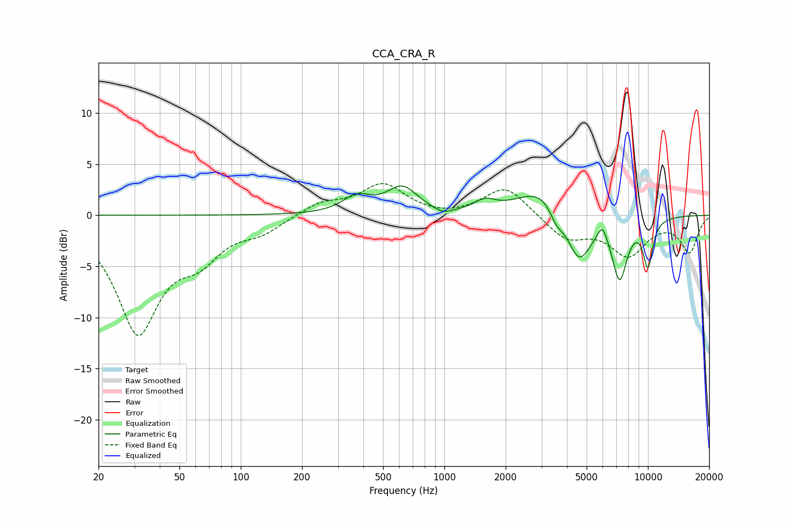

# CCA_CRA_R
See [usage instructions](https://github.com/jaakkopasanen/AutoEq#usage) for more options and info.

### Parametric EQs
Apply preamp of -3.0 dB when using parametric equalizer.

|   # | Type    |   Fc (Hz) |    Q |   Gain (dB) |
|-----|---------|-----------|------|-------------|
|   1 | Peaking |       371 | 2.06 |         1.6 |
|   2 | Peaking |       621 | 1.87 |         2.6 |
|   3 | Peaking |       981 | 3.03 |        -0.6 |
|   4 | Peaking |      1583 | 2.79 |         1   |
|   5 | Peaking |      3005 | 1.18 |         2.8 |
|   6 | Peaking |      3554 | 4.34 |        -1.4 |
|   7 | Peaking |      4584 | 2.27 |        -4.8 |
|   8 | Peaking |      5977 | 5.99 |         1.5 |
|   9 | Peaking |      7263 | 3.56 |        -5.9 |
|  10 | Peaking |     10000 | 5.12 |        -4.5 |

### Fixed Band EQs
When using fixed band (also called graphic) equalizer, apply preamp of **-3.2 dB** (if available) and set gains manually with these parameters.

|   # | Type    |   Fc (Hz) |    Q |   Gain (dB) |
|-----|---------|-----------|------|-------------|
|   1 | Peaking |        31 | 1.41 |       -11.1 |
|   2 | Peaking |        62 | 1.41 |        -3.1 |
|   3 | Peaking |       125 | 1.41 |        -1.3 |
|   4 | Peaking |       250 | 1.41 |         1.2 |
|   5 | Peaking |       500 | 1.41 |         3   |
|   6 | Peaking |      1000 | 1.41 |        -0.3 |
|   7 | Peaking |      2000 | 1.41 |         2.9 |
|   8 | Peaking |      4000 | 1.41 |        -2.3 |
|   9 | Peaking |      8000 | 1.41 |        -3.7 |
|  10 | Peaking |     16000 | 1.41 |        -3.5 |

### Graphs

