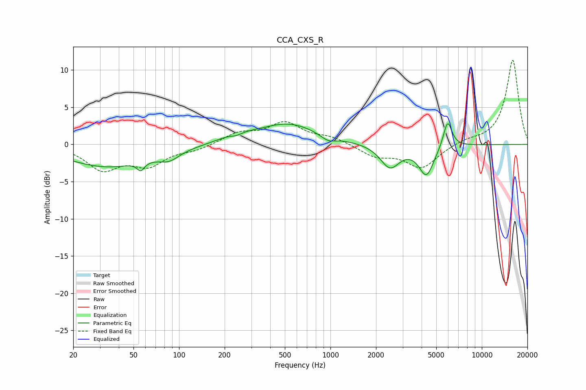

# CCA_CXS_R
See [usage instructions](https://github.com/jaakkopasanen/AutoEq#usage) for more options and info.

### Parametric EQs
Apply preamp of -2.9 dB when using parametric equalizer.

|   # | Type    |   Fc (Hz) |    Q |   Gain (dB) |
|-----|---------|-----------|------|-------------|
|   1 | Peaking |        33 | 0.53 |        -3   |
|   2 | Peaking |        56 | 6    |        -1.1 |
|   3 | Peaking |        86 | 2.09 |        -1.2 |
|   4 | Peaking |       239 | 1.39 |         0.9 |
|   5 | Peaking |       240 | 3.33 |        -0.5 |
|   6 | Peaking |       528 | 0.72 |         2.7 |
|   7 | Peaking |       965 | 2.77 |        -0.8 |
|   8 | Peaking |      2473 | 2.23 |        -3.1 |
|   9 | Peaking |      4307 | 2.83 |        -4   |
|  10 | Peaking |      5943 | 4.78 |         3.7 |

### Fixed Band EQs
When using fixed band (also called graphic) equalizer, apply preamp of **-11.4 dB** (if available) and set gains manually with these parameters.

|   # | Type    |   Fc (Hz) |    Q |   Gain (dB) |
|-----|---------|-----------|------|-------------|
|   1 | Peaking |        31 | 1.41 |        -3.2 |
|   2 | Peaking |        62 | 1.41 |        -2.6 |
|   3 | Peaking |       125 | 1.41 |        -0.7 |
|   4 | Peaking |       250 | 1.41 |         1.4 |
|   5 | Peaking |       500 | 1.41 |         2.8 |
|   6 | Peaking |      1000 | 1.41 |         0.9 |
|   7 | Peaking |      2000 | 1.41 |        -1.5 |
|   8 | Peaking |      4000 | 1.41 |        -3.1 |
|   9 | Peaking |      8000 | 1.41 |         0.5 |
|  10 | Peaking |     16000 | 1.41 |        11.4 |

### Graphs

