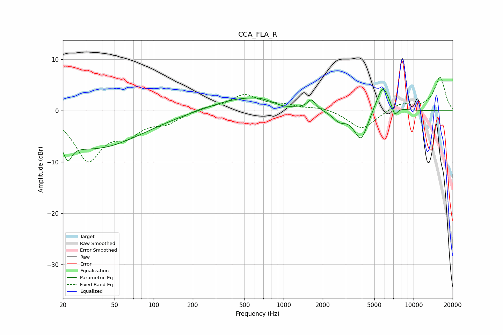

# CCA_FLA_R
See [usage instructions](https://github.com/jaakkopasanen/AutoEq#usage) for more options and info.

### Parametric EQs
Apply preamp of -4.2 dB when using parametric equalizer.

|   # | Type    |   Fc (Hz) |    Q |   Gain (dB) |
|-----|---------|-----------|------|-------------|
|   1 | Peaking |        22 | 4.79 |        -3.3 |
|   2 | Peaking |        34 | 0.38 |        -7.3 |
|   3 | Peaking |       487 | 0.59 |         2.5 |
|   4 | Peaking |       653 | 1.99 |         0.4 |
|   5 | Peaking |       997 | 2.69 |        -0.4 |
|   6 | Peaking |      1637 | 4.66 |         1.9 |
|   7 | Peaking |      2684 | 2.76 |        -1.7 |
|   8 | Peaking |      3937 | 2.65 |        -5.9 |
|   9 | Peaking |      5796 | 2.7  |         5.4 |
|  10 | Peaking |      7155 | 5.96 |        -2.1 |

### Fixed Band EQs
When using fixed band (also called graphic) equalizer, apply preamp of **-6.7 dB** (if available) and set gains manually with these parameters.

|   # | Type    |   Fc (Hz) |    Q |   Gain (dB) |
|-----|---------|-----------|------|-------------|
|   1 | Peaking |        31 | 1.41 |        -9.3 |
|   2 | Peaking |        62 | 1.41 |        -3.5 |
|   3 | Peaking |       125 | 1.41 |        -2   |
|   4 | Peaking |       250 | 1.41 |         0.6 |
|   5 | Peaking |       500 | 1.41 |         3   |
|   6 | Peaking |      1000 | 1.41 |         0.9 |
|   7 | Peaking |      2000 | 1.41 |         0.7 |
|   8 | Peaking |      4000 | 1.41 |        -3.7 |
|   9 | Peaking |      8000 | 1.41 |         1.4 |
|  10 | Peaking |     16000 | 1.41 |         6.6 |

### Graphs

