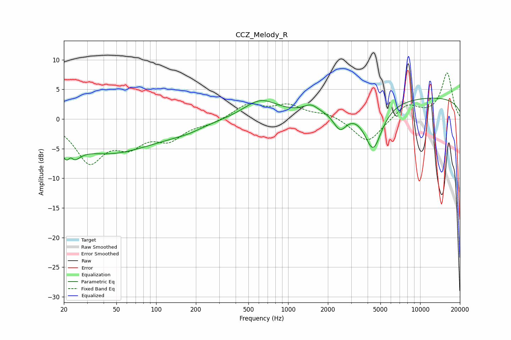

# CCZ_Melody_R
See [usage instructions](https://github.com/jaakkopasanen/AutoEq#usage) for more options and info.

### Parametric EQs
Apply preamp of -3.6 dB when using parametric equalizer.

|   # | Type    |   Fc (Hz) |    Q |   Gain (dB) |
|-----|---------|-----------|------|-------------|
|   1 | Peaking |        22 | 2.79 |        -5.6 |
|   2 | Peaking |        22 | 5.94 |         2.6 |
|   3 | Peaking |        42 | 0.49 |        -5   |
|   4 | Peaking |       113 | 0.59 |        -1.4 |
|   5 | Peaking |       175 | 1.35 |        -0.6 |
|   6 | Peaking |       618 | 1.09 |         3.1 |
|   7 | Peaking |      1485 | 2.65 |         1.2 |
|   8 | Peaking |      2474 | 2.78 |        -3.2 |
|   9 | Peaking |      4407 | 2.06 |        -7.8 |
|  10 | Peaking |     10000 | 0.18 |         3.7 |

### Fixed Band EQs
When using fixed band (also called graphic) equalizer, apply preamp of **-7.9 dB** (if available) and set gains manually with these parameters.

|   # | Type    |   Fc (Hz) |    Q |   Gain (dB) |
|-----|---------|-----------|------|-------------|
|   1 | Peaking |        31 | 1.41 |        -6.9 |
|   2 | Peaking |        62 | 1.41 |        -3.6 |
|   3 | Peaking |       125 | 1.41 |        -3   |
|   4 | Peaking |       250 | 1.41 |        -0.7 |
|   5 | Peaking |       500 | 1.41 |         2.4 |
|   6 | Peaking |      1000 | 1.41 |         2.1 |
|   7 | Peaking |      2000 | 1.41 |         0.9 |
|   8 | Peaking |      4000 | 1.41 |        -4.2 |
|   9 | Peaking |      8000 | 1.41 |         2.4 |
|  10 | Peaking |     16000 | 1.41 |         7.7 |

### Graphs

