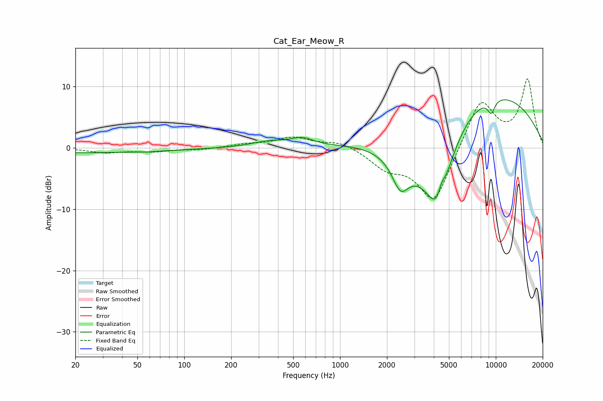

# Cat_Ear_Meow_R
See [usage instructions](https://github.com/jaakkopasanen/AutoEq#usage) for more options and info.

### Parametric EQs
Apply preamp of -7.9 dB when using parametric equalizer.

|   # | Type    |   Fc (Hz) |    Q |   Gain (dB) |
|-----|---------|-----------|------|-------------|
|   1 | Peaking |        20 | 0.22 |        -0.8 |
|   2 | Peaking |        59 | 3.28 |        -0.1 |
|   3 | Peaking |       354 | 1.26 |         1   |
|   4 | Peaking |       574 | 2.06 |         1.2 |
|   5 | Peaking |      2442 | 2.66 |        -4.6 |
|   6 | Peaking |      3185 | 0.67 |        -6.7 |
|   7 | Peaking |      4264 | 1.63 |       -12.2 |
|   8 | Peaking |      4472 | 5.9  |         2.2 |
|   9 | Peaking |      7483 | 0.27 |        10.6 |
|  10 | Peaking |      9349 | 5.39 |        -2.2 |

### Fixed Band EQs
When using fixed band (also called graphic) equalizer, apply preamp of **-11.3 dB** (if available) and set gains manually with these parameters.

|   # | Type    |   Fc (Hz) |    Q |   Gain (dB) |
|-----|---------|-----------|------|-------------|
|   1 | Peaking |        31 | 1.41 |        -0.7 |
|   2 | Peaking |        62 | 1.41 |        -0.5 |
|   3 | Peaking |       125 | 1.41 |        -0.3 |
|   4 | Peaking |       250 | 1.41 |         0.5 |
|   5 | Peaking |       500 | 1.41 |         1.6 |
|   6 | Peaking |      1000 | 1.41 |         1.1 |
|   7 | Peaking |      2000 | 1.41 |        -2.8 |
|   8 | Peaking |      4000 | 1.41 |        -9.1 |
|   9 | Peaking |      8000 | 1.41 |         8.1 |
|  10 | Peaking |     16000 | 1.41 |        11   |

### Graphs

