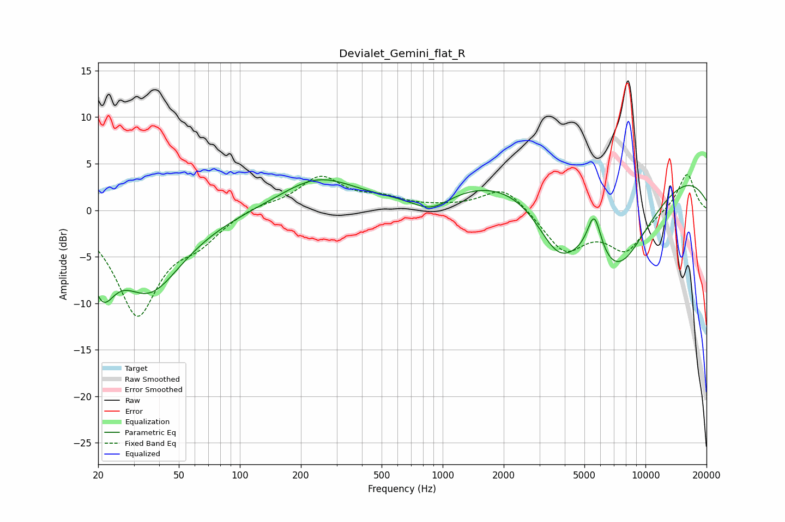

# Devialet_Gemini_flat_R
See [usage instructions](https://github.com/jaakkopasanen/AutoEq#usage) for more options and info.

### Parametric EQs
Apply preamp of -3.4 dB when using parametric equalizer.

|   # | Type    |   Fc (Hz) |    Q |   Gain (dB) |
|-----|---------|-----------|------|-------------|
|   1 | Peaking |        21 | 2.41 |        -5.5 |
|   2 | Peaking |        27 | 2.2  |         0.3 |
|   3 | Peaking |        36 | 0.83 |        -8.4 |
|   4 | Peaking |       150 | 0.87 |        -0   |
|   5 | Peaking |       242 | 0.76 |         3.4 |
|   6 | Peaking |       879 | 1.48 |        -1.9 |
|   7 | Peaking |      3701 | 1.26 |        -5.7 |
|   8 | Peaking |      5590 | 3.88 |         4.7 |
|   9 | Peaking |      6717 | 0.18 |         8.2 |
|  10 | Peaking |      7175 | 0.62 |       -13.3 |

### Fixed Band EQs
When using fixed band (also called graphic) equalizer, apply preamp of **-3.9 dB** (if available) and set gains manually with these parameters.

|   # | Type    |   Fc (Hz) |    Q |   Gain (dB) |
|-----|---------|-----------|------|-------------|
|   1 | Peaking |        31 | 1.41 |       -11   |
|   2 | Peaking |        62 | 1.41 |        -2.4 |
|   3 | Peaking |       125 | 1.41 |         0.6 |
|   4 | Peaking |       250 | 1.41 |         3.5 |
|   5 | Peaking |       500 | 1.41 |         1.1 |
|   6 | Peaking |      1000 | 1.41 |         0.2 |
|   7 | Peaking |      2000 | 1.41 |         2.7 |
|   8 | Peaking |      4000 | 1.41 |        -4.3 |
|   9 | Peaking |      8000 | 1.41 |        -4.1 |
|  10 | Peaking |     16000 | 1.41 |         4.1 |

### Graphs

