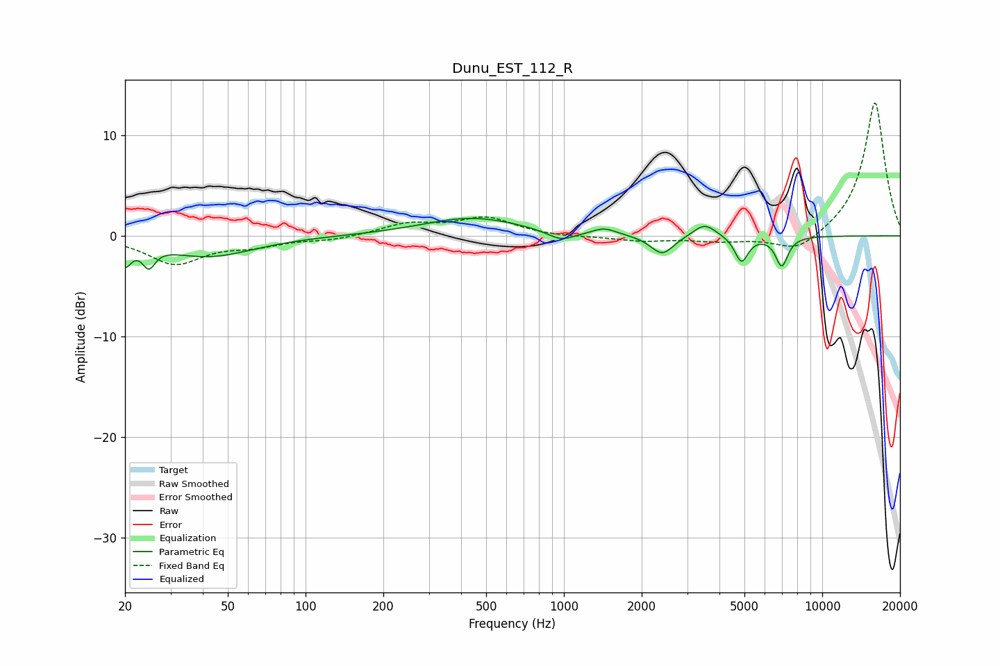

# Dunu_EST_112_R
See [usage instructions](https://github.com/jaakkopasanen/AutoEq#usage) for more options and info.

### Parametric EQs
Apply preamp of -1.8 dB when using parametric equalizer.

|   # | Type    |   Fc (Hz) |    Q |   Gain (dB) |
|-----|---------|-----------|------|-------------|
|   1 | Peaking |        20 | 5.95 |        -2.2 |
|   2 | Peaking |        25 | 5.94 |        -1.9 |
|   3 | Peaking |        42 | 0.82 |        -2   |
|   4 | Peaking |       440 | 0.74 |         1.8 |
|   5 | Peaking |       974 | 2.63 |        -1   |
|   6 | Peaking |      1433 | 3.06 |         0.7 |
|   7 | Peaking |      2402 | 3.16 |        -1.9 |
|   8 | Peaking |      3507 | 3.18 |         1.3 |
|   9 | Peaking |      4868 | 5.46 |        -2.6 |
|  10 | Peaking |      6968 | 5.63 |        -2.9 |

### Fixed Band EQs
When using fixed band (also called graphic) equalizer, apply preamp of **-13.3 dB** (if available) and set gains manually with these parameters.

|   # | Type    |   Fc (Hz) |    Q |   Gain (dB) |
|-----|---------|-----------|------|-------------|
|   1 | Peaking |        31 | 1.41 |        -2.7 |
|   2 | Peaking |        62 | 1.41 |        -0.8 |
|   3 | Peaking |       125 | 1.41 |        -0.4 |
|   4 | Peaking |       250 | 1.41 |         1.1 |
|   5 | Peaking |       500 | 1.41 |         1.7 |
|   6 | Peaking |      1000 | 1.41 |        -0.1 |
|   7 | Peaking |      2000 | 1.41 |        -0.5 |
|   8 | Peaking |      4000 | 1.41 |        -0.5 |
|   9 | Peaking |      8000 | 1.41 |        -1.8 |
|  10 | Peaking |     16000 | 1.41 |        13.4 |

### Graphs

