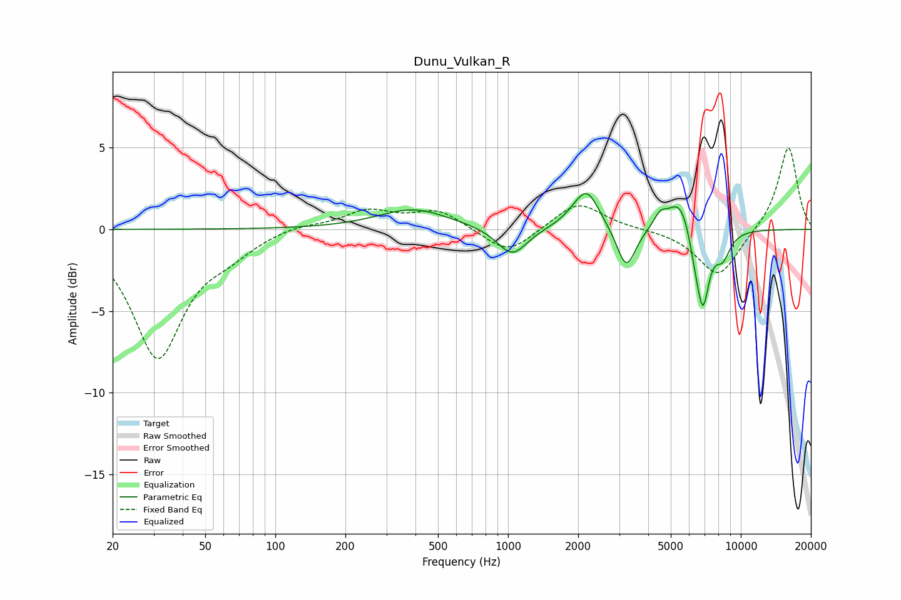

# Dunu_Vulkan_R
See [usage instructions](https://github.com/jaakkopasanen/AutoEq#usage) for more options and info.

### Parametric EQs
Apply preamp of -2.3 dB when using parametric equalizer.

|   # | Type    |   Fc (Hz) |    Q |   Gain (dB) |
|-----|---------|-----------|------|-------------|
|   1 | Peaking |       392 | 0.92 |         1.2 |
|   2 | Peaking |      1040 | 2.21 |        -1.8 |
|   3 | Peaking |      1973 | 2.13 |         0.5 |
|   4 | Peaking |      2188 | 2.68 |         2.1 |
|   5 | Peaking |      3220 | 3.48 |        -2.6 |
|   6 | Peaking |      4506 | 5.04 |         0.8 |
|   7 | Peaking |      5471 | 2.68 |         2.1 |
|   8 | Peaking |      6297 | 6    |        -0.9 |
|   9 | Peaking |      6857 | 4.85 |        -4.7 |
|  10 | Peaking |      8348 | 3.89 |        -1.5 |

### Fixed Band EQs
When using fixed band (also called graphic) equalizer, apply preamp of **-5.1 dB** (if available) and set gains manually with these parameters.

|   # | Type    |   Fc (Hz) |    Q |   Gain (dB) |
|-----|---------|-----------|------|-------------|
|   1 | Peaking |        31 | 1.41 |        -7.7 |
|   2 | Peaking |        62 | 1.41 |        -1   |
|   3 | Peaking |       125 | 1.41 |         0.3 |
|   4 | Peaking |       250 | 1.41 |         1.1 |
|   5 | Peaking |       500 | 1.41 |         1.1 |
|   6 | Peaking |      1000 | 1.41 |        -1.6 |
|   7 | Peaking |      2000 | 1.41 |         1.7 |
|   8 | Peaking |      4000 | 1.41 |         0   |
|   9 | Peaking |      8000 | 1.41 |        -2.9 |
|  10 | Peaking |     16000 | 1.41 |         5.1 |

### Graphs

