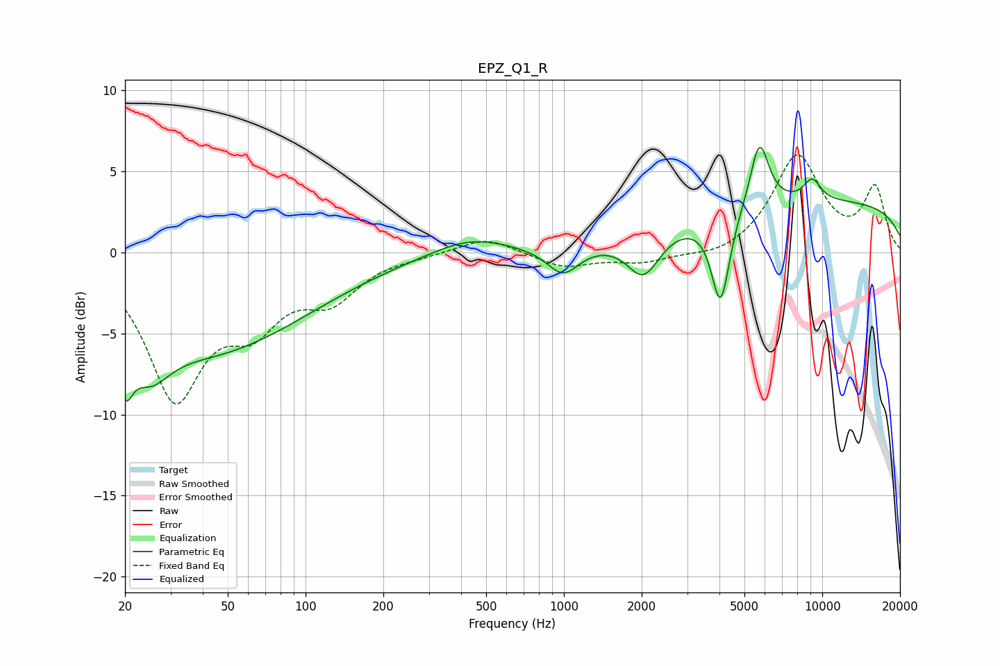

# EPZ_Q1_R
See [usage instructions](https://github.com/jaakkopasanen/AutoEq#usage) for more options and info.

### Parametric EQs
Apply preamp of -6.6 dB when using parametric equalizer.

|   # | Type    |   Fc (Hz) |    Q |   Gain (dB) |
|-----|---------|-----------|------|-------------|
|   1 | Peaking |        20 | 4.82 |        -3.1 |
|   2 | Peaking |        25 | 1.89 |        -2.5 |
|   3 | Peaking |        41 | 0.36 |        -6   |
|   4 | Peaking |       431 | 0.96 |         1.1 |
|   5 | Peaking |       993 | 2.25 |        -1.8 |
|   6 | Peaking |      2032 | 2.23 |        -2.7 |
|   7 | Peaking |      4040 | 3.97 |        -5.6 |
|   8 | Peaking |      5710 | 3.74 |         4.2 |
|   9 | Peaking |      9145 | 3.75 |         1.3 |
|  10 | Peaking |      9823 | 0.18 |         3.1 |

### Fixed Band EQs
When using fixed band (also called graphic) equalizer, apply preamp of **-6.1 dB** (if available) and set gains manually with these parameters.

|   # | Type    |   Fc (Hz) |    Q |   Gain (dB) |
|-----|---------|-----------|------|-------------|
|   1 | Peaking |        31 | 1.41 |        -8.6 |
|   2 | Peaking |        62 | 1.41 |        -3.5 |
|   3 | Peaking |       125 | 1.41 |        -2.5 |
|   4 | Peaking |       250 | 1.41 |        -0.1 |
|   5 | Peaking |       500 | 1.41 |         1   |
|   6 | Peaking |      1000 | 1.41 |        -0.9 |
|   7 | Peaking |      2000 | 1.41 |        -0.6 |
|   8 | Peaking |      4000 | 1.41 |        -0.4 |
|   9 | Peaking |      8000 | 1.41 |         5.9 |
|  10 | Peaking |     16000 | 1.41 |         3.9 |

### Graphs

