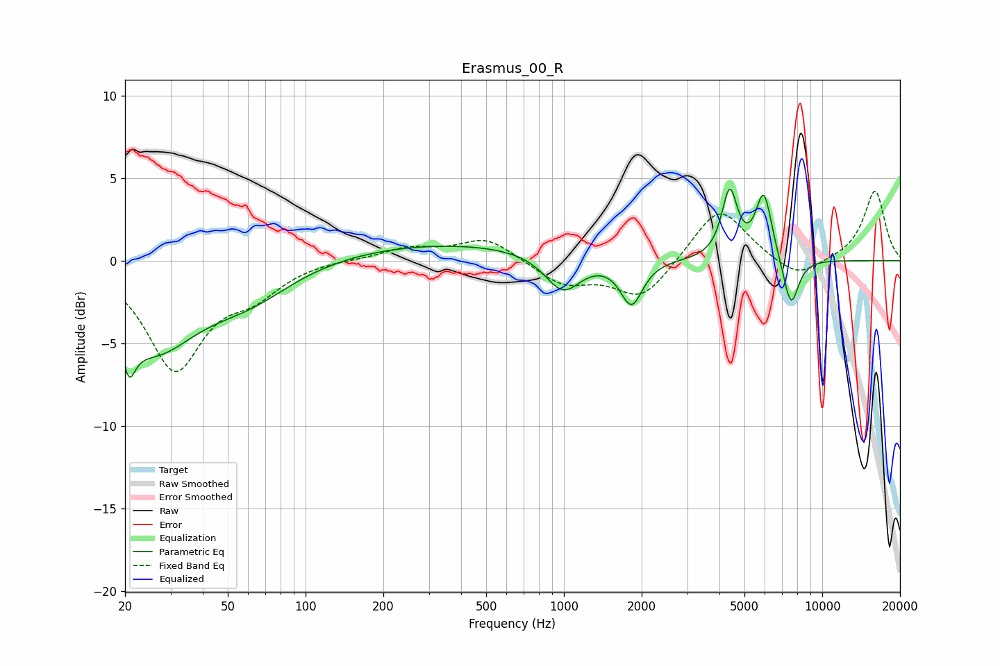

# Erasmus_00_R
See [usage instructions](https://github.com/jaakkopasanen/AutoEq#usage) for more options and info.

### Parametric EQs
Apply preamp of -4.4 dB when using parametric equalizer.

|   # | Type    |   Fc (Hz) |    Q |   Gain (dB) |
|-----|---------|-----------|------|-------------|
|   1 | Peaking |        21 | 5.68 |         3.3 |
|   2 | Peaking |        21 | 5.67 |        -5.6 |
|   3 | Peaking |        26 | 0.85 |        -5   |
|   4 | Peaking |        60 | 0.82 |        -1.8 |
|   5 | Peaking |       342 | 0.32 |         1.1 |
|   6 | Peaking |       992 | 2.02 |        -2.3 |
|   7 | Peaking |      1827 | 3.31 |        -2.7 |
|   8 | Peaking |      4381 | 4.67 |         4   |
|   9 | Peaking |      5942 | 4.37 |         4   |
|  10 | Peaking |      7562 | 4.42 |        -3   |

### Fixed Band EQs
When using fixed band (also called graphic) equalizer, apply preamp of **-4.3 dB** (if available) and set gains manually with these parameters.

|   # | Type    |   Fc (Hz) |    Q |   Gain (dB) |
|-----|---------|-----------|------|-------------|
|   1 | Peaking |        31 | 1.41 |        -6.4 |
|   2 | Peaking |        62 | 1.41 |        -1.6 |
|   3 | Peaking |       125 | 1.41 |         0.1 |
|   4 | Peaking |       250 | 1.41 |         0.7 |
|   5 | Peaking |       500 | 1.41 |         1.4 |
|   6 | Peaking |      1000 | 1.41 |        -1.4 |
|   7 | Peaking |      2000 | 1.41 |        -2.3 |
|   8 | Peaking |      4000 | 1.41 |         3.4 |
|   9 | Peaking |      8000 | 1.41 |        -1.2 |
|  10 | Peaking |     16000 | 1.41 |         4.3 |

### Graphs

