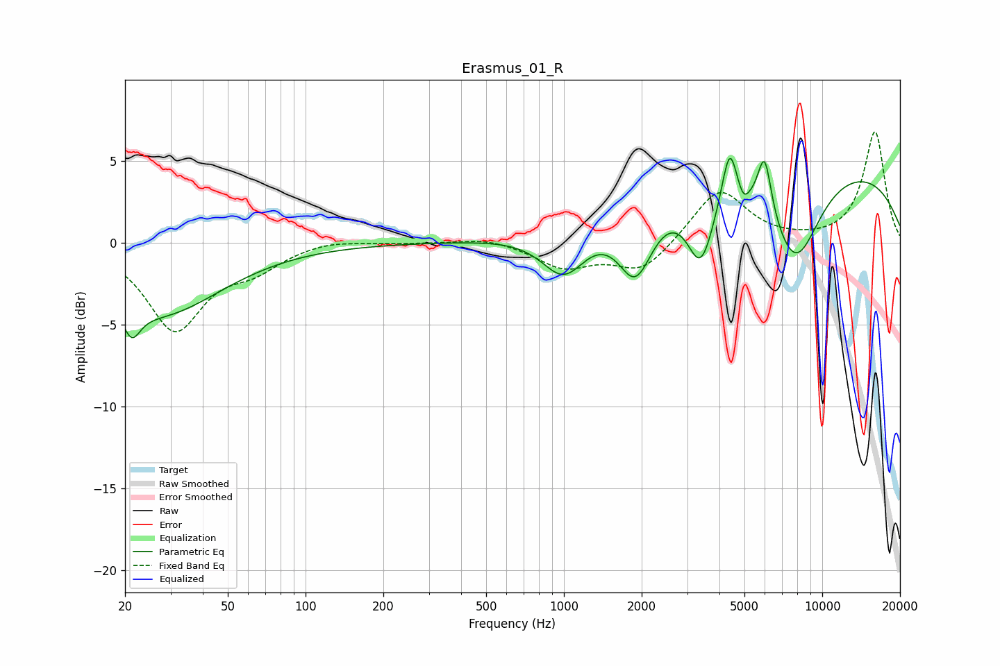

# Erasmus_01_R
See [usage instructions](https://github.com/jaakkopasanen/AutoEq#usage) for more options and info.

### Parametric EQs
Apply preamp of -5.2 dB when using parametric equalizer.

|   # | Type    |   Fc (Hz) |    Q |   Gain (dB) |
|-----|---------|-----------|------|-------------|
|   1 | Peaking |        21 | 4.25 |        -1.8 |
|   2 | Peaking |        27 | 0.59 |        -4.3 |
|   3 | Peaking |      1000 | 1.64 |        -2.9 |
|   4 | Peaking |      1895 | 2.08 |        -4.3 |
|   5 | Peaking |      3390 | 2.64 |        -4.5 |
|   6 | Peaking |      4382 | 4.84 |         3.4 |
|   7 | Peaking |      4947 | 5.99 |        -0.9 |
|   8 | Peaking |      5982 | 5.24 |         3.6 |
|   9 | Peaking |      7672 | 0.18 |         5.2 |
|  10 | Peaking |      7850 | 1.31 |        -5.9 |

### Fixed Band EQs
When using fixed band (also called graphic) equalizer, apply preamp of **-6.9 dB** (if available) and set gains manually with these parameters.

|   # | Type    |   Fc (Hz) |    Q |   Gain (dB) |
|-----|---------|-----------|------|-------------|
|   1 | Peaking |        31 | 1.41 |        -5.2 |
|   2 | Peaking |        62 | 1.41 |        -1.3 |
|   3 | Peaking |       125 | 1.41 |         0.3 |
|   4 | Peaking |       250 | 1.41 |        -0   |
|   5 | Peaking |       500 | 1.41 |         0.3 |
|   6 | Peaking |      1000 | 1.41 |        -1.5 |
|   7 | Peaking |      2000 | 1.41 |        -1.8 |
|   8 | Peaking |      4000 | 1.41 |         3.3 |
|   9 | Peaking |      8000 | 1.41 |         0   |
|  10 | Peaking |     16000 | 1.41 |         6.8 |

### Graphs

