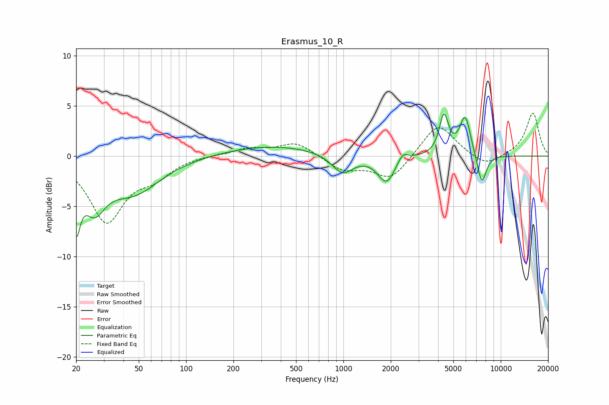

# Erasmus_10_R
See [usage instructions](https://github.com/jaakkopasanen/AutoEq#usage) for more options and info.

### Parametric EQs
Apply preamp of -4.3 dB when using parametric equalizer.

|   # | Type    |   Fc (Hz) |    Q |   Gain (dB) |
|-----|---------|-----------|------|-------------|
|   1 | Peaking |        20 | 5.57 |        -5.3 |
|   2 | Peaking |        26 | 2.09 |        -3.8 |
|   3 | Peaking |        46 | 0.82 |        -3.5 |
|   4 | Peaking |       350 | 0.45 |         1.1 |
|   5 | Peaking |       986 | 2.1  |        -1.9 |
|   6 | Peaking |      1884 | 2.54 |        -2.7 |
|   7 | Peaking |      2377 | 4.11 |         1   |
|   8 | Peaking |      4354 | 4.85 |         3.9 |
|   9 | Peaking |      5947 | 3.89 |         4   |
|  10 | Peaking |      7567 | 4.47 |        -3.1 |

### Fixed Band EQs
When using fixed band (also called graphic) equalizer, apply preamp of **-4.4 dB** (if available) and set gains manually with these parameters.

|   # | Type    |   Fc (Hz) |    Q |   Gain (dB) |
|-----|---------|-----------|------|-------------|
|   1 | Peaking |        31 | 1.41 |        -6.4 |
|   2 | Peaking |        62 | 1.41 |        -1.7 |
|   3 | Peaking |       125 | 1.41 |         0.1 |
|   4 | Peaking |       250 | 1.41 |         0.7 |
|   5 | Peaking |       500 | 1.41 |         1.4 |
|   6 | Peaking |      1000 | 1.41 |        -1.4 |
|   7 | Peaking |      2000 | 1.41 |        -2.3 |
|   8 | Peaking |      4000 | 1.41 |         3.4 |
|   9 | Peaking |      8000 | 1.41 |        -1.1 |
|  10 | Peaking |     16000 | 1.41 |         4.3 |

### Graphs

