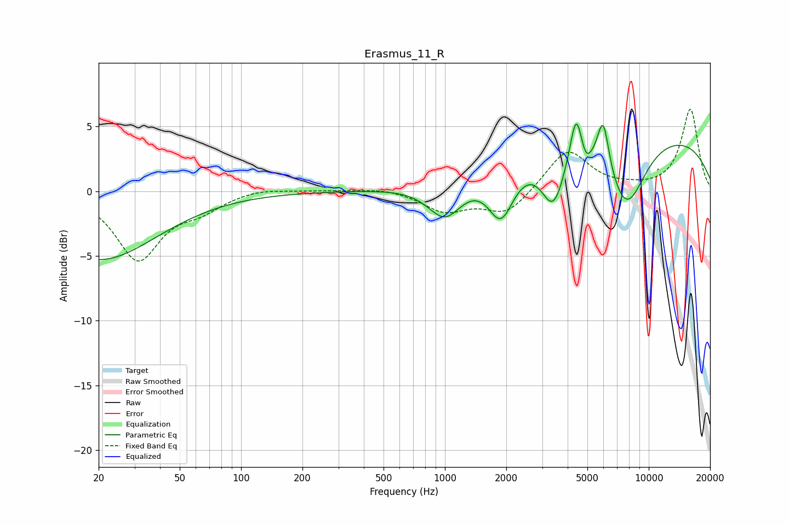

# Erasmus_11_R
See [usage instructions](https://github.com/jaakkopasanen/AutoEq#usage) for more options and info.

### Parametric EQs
Apply preamp of -5.3 dB when using parametric equalizer.

|   # | Type    |   Fc (Hz) |    Q |   Gain (dB) |
|-----|---------|-----------|------|-------------|
|   1 | Peaking |        20 | 0.5  |        -5.3 |
|   2 | Peaking |      1001 | 1.67 |        -2.9 |
|   3 | Peaking |      1885 | 2.2  |        -4   |
|   4 | Peaking |      3406 | 2.39 |        -4.3 |
|   5 | Peaking |      4406 | 4.68 |         4   |
|   6 | Peaking |      4899 | 4.63 |        -0.8 |
|   7 | Peaking |      4910 | 6    |        -0.4 |
|   8 | Peaking |      5977 | 4.78 |         4   |
|   9 | Peaking |      7745 | 1.36 |        -5.7 |
|  10 | Peaking |      7768 | 0.18 |         4.8 |

### Fixed Band EQs
When using fixed band (also called graphic) equalizer, apply preamp of **-6.4 dB** (if available) and set gains manually with these parameters.

|   # | Type    |   Fc (Hz) |    Q |   Gain (dB) |
|-----|---------|-----------|------|-------------|
|   1 | Peaking |        31 | 1.41 |        -5.2 |
|   2 | Peaking |        62 | 1.41 |        -1.1 |
|   3 | Peaking |       125 | 1.41 |         0.3 |
|   4 | Peaking |       250 | 1.41 |         0.1 |
|   5 | Peaking |       500 | 1.41 |         0.3 |
|   6 | Peaking |      1000 | 1.41 |        -1.5 |
|   7 | Peaking |      2000 | 1.41 |        -1.8 |
|   8 | Peaking |      4000 | 1.41 |         3.3 |
|   9 | Peaking |      8000 | 1.41 |         0.2 |
|  10 | Peaking |     16000 | 1.41 |         6.3 |

### Graphs

