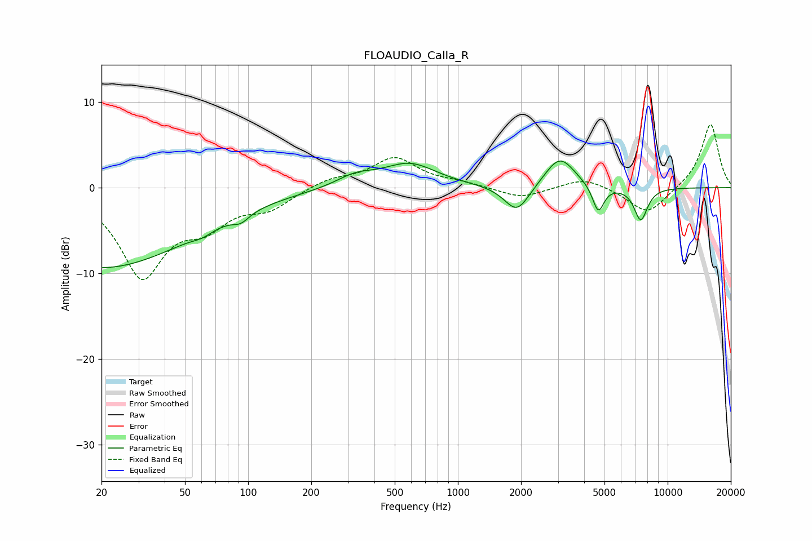

# FLOAUDIO_Calla_R
See [usage instructions](https://github.com/jaakkopasanen/AutoEq#usage) for more options and info.

### Parametric EQs
Apply preamp of -3.2 dB when using parametric equalizer.

|   # | Type    |   Fc (Hz) |    Q |   Gain (dB) |
|-----|---------|-----------|------|-------------|
|   1 | Peaking |        20 | 0.32 |        -9.3 |
|   2 | Peaking |        60 | 2.95 |        -0.5 |
|   3 | Peaking |        92 | 3.71 |        -0.9 |
|   4 | Peaking |       324 | 1.53 |         1.2 |
|   5 | Peaking |       590 | 1.1  |         2.7 |
|   6 | Peaking |      1912 | 2.36 |        -3.3 |
|   7 | Peaking |      3060 | 1.98 |         3.7 |
|   8 | Peaking |      4669 | 5.12 |        -3.2 |
|   9 | Peaking |      7458 | 4.51 |        -4.7 |
|  10 | Peaking |      7498 | 5.99 |         0.9 |

### Fixed Band EQs
When using fixed band (also called graphic) equalizer, apply preamp of **-7.5 dB** (if available) and set gains manually with these parameters.

|   # | Type    |   Fc (Hz) |    Q |   Gain (dB) |
|-----|---------|-----------|------|-------------|
|   1 | Peaking |        31 | 1.41 |       -10.1 |
|   2 | Peaking |        62 | 1.41 |        -3.4 |
|   3 | Peaking |       125 | 1.41 |        -2.1 |
|   4 | Peaking |       250 | 1.41 |         1   |
|   5 | Peaking |       500 | 1.41 |         3.4 |
|   6 | Peaking |      1000 | 1.41 |         0.5 |
|   7 | Peaking |      2000 | 1.41 |        -1.3 |
|   8 | Peaking |      4000 | 1.41 |         1.3 |
|   9 | Peaking |      8000 | 1.41 |        -3.2 |
|  10 | Peaking |     16000 | 1.41 |         7.6 |

### Graphs

