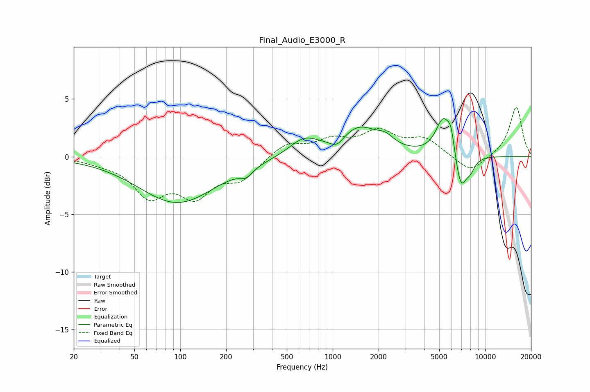

# Final_Audio_E3000_R
See [usage instructions](https://github.com/jaakkopasanen/AutoEq#usage) for more options and info.

### Parametric EQs
Apply preamp of -3.4 dB when using parametric equalizer.

|   # | Type    |   Fc (Hz) |    Q |   Gain (dB) |
|-----|---------|-----------|------|-------------|
|   1 | Peaking |        96 | 0.56 |        -4   |
|   2 | Peaking |       271 | 3.38 |        -0.7 |
|   3 | Peaking |       647 | 1.47 |         1.4 |
|   4 | Peaking |      1067 | 2.92 |        -0.9 |
|   5 | Peaking |      1485 | 1.06 |         2.5 |
|   6 | Peaking |      2226 | 2.68 |         0.7 |
|   7 | Peaking |      5315 | 2.78 |         3.2 |
|   8 | Peaking |      5974 | 5.98 |         1.6 |
|   9 | Peaking |      6927 | 3.63 |        -3.1 |
|  10 | Peaking |      8011 | 4.18 |        -0.9 |

### Fixed Band EQs
When using fixed band (also called graphic) equalizer, apply preamp of **-4.4 dB** (if available) and set gains manually with these parameters.

|   # | Type    |   Fc (Hz) |    Q |   Gain (dB) |
|-----|---------|-----------|------|-------------|
|   1 | Peaking |        31 | 1.41 |        -0.4 |
|   2 | Peaking |        62 | 1.41 |        -3.1 |
|   3 | Peaking |       125 | 1.41 |        -3   |
|   4 | Peaking |       250 | 1.41 |        -1.8 |
|   5 | Peaking |       500 | 1.41 |         1.2 |
|   6 | Peaking |      1000 | 1.41 |         1.2 |
|   7 | Peaking |      2000 | 1.41 |         2   |
|   8 | Peaking |      4000 | 1.41 |         1.4 |
|   9 | Peaking |      8000 | 1.41 |        -1.4 |
|  10 | Peaking |     16000 | 1.41 |         4.3 |

### Graphs

