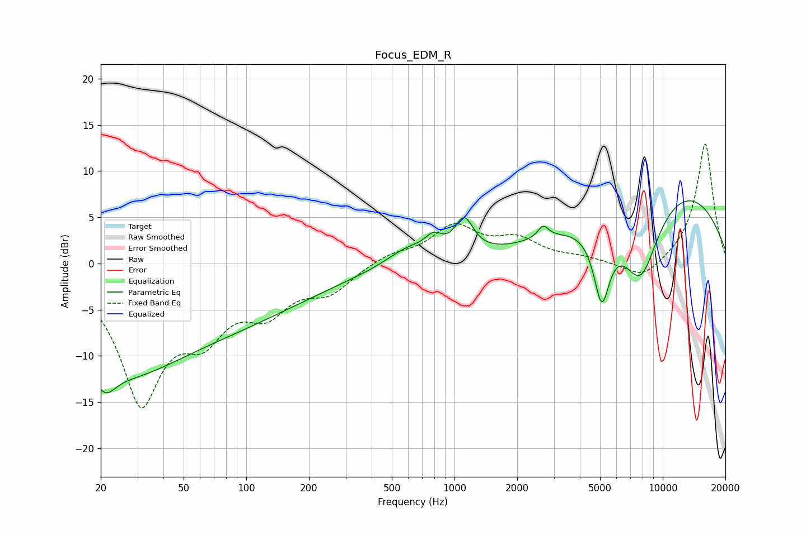

# Focus_EDM_R
See [usage instructions](https://github.com/jaakkopasanen/AutoEq#usage) for more options and info.

### Parametric EQs
Apply preamp of -6.9 dB when using parametric equalizer.

|   # | Type    |   Fc (Hz) |    Q |   Gain (dB) |
|-----|---------|-----------|------|-------------|
|   1 | Peaking |        21 | 2.84 |        -2.7 |
|   2 | Peaking |        26 | 0.59 |        -4.3 |
|   3 | Peaking |        35 | 0.18 |        -7.7 |
|   4 | Peaking |       596 | 1.34 |         1.8 |
|   5 | Peaking |       794 | 3.42 |         1.7 |
|   6 | Peaking |      1113 | 3.17 |         3.8 |
|   7 | Peaking |      2665 | 5.56 |         1.3 |
|   8 | Peaking |      5095 | 3.54 |        -7.8 |
|   9 | Peaking |      7816 | 1.38 |        -9.4 |
|  10 | Peaking |     10000 | 0.3  |         9.2 |

### Fixed Band EQs
When using fixed band (also called graphic) equalizer, apply preamp of **-13.0 dB** (if available) and set gains manually with these parameters.

|   # | Type    |   Fc (Hz) |    Q |   Gain (dB) |
|-----|---------|-----------|------|-------------|
|   1 | Peaking |        31 | 1.41 |       -14.4 |
|   2 | Peaking |        62 | 1.41 |        -5.6 |
|   3 | Peaking |       125 | 1.41 |        -4.2 |
|   4 | Peaking |       250 | 1.41 |        -2.7 |
|   5 | Peaking |       500 | 1.41 |         1   |
|   6 | Peaking |      1000 | 1.41 |         3.8 |
|   7 | Peaking |      2000 | 1.41 |         2.3 |
|   8 | Peaking |      4000 | 1.41 |         0.5 |
|   9 | Peaking |      8000 | 1.41 |        -2   |
|  10 | Peaking |     16000 | 1.41 |        13.1 |

### Graphs

