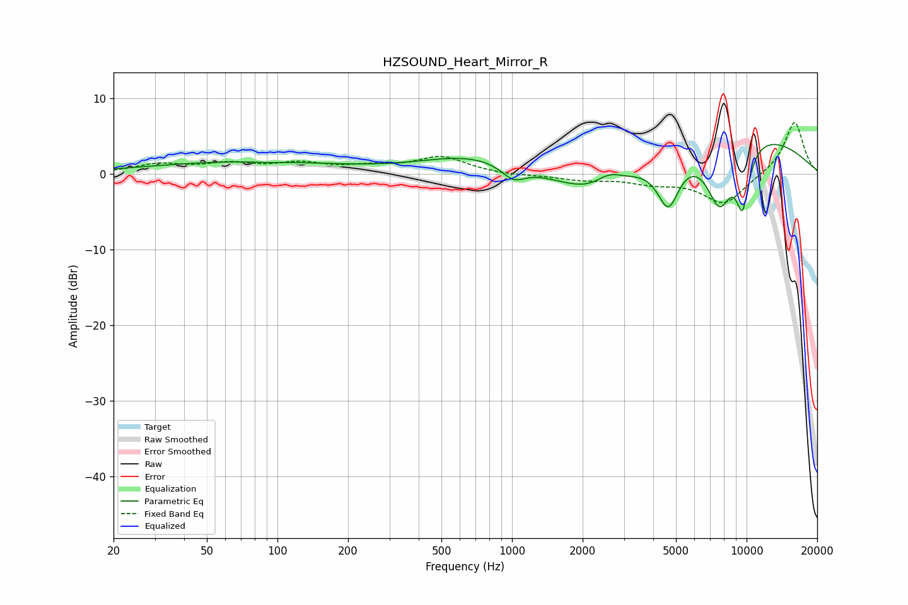

# HZSOUND_Heart_Mirror_R
See [usage instructions](https://github.com/jaakkopasanen/AutoEq#usage) for more options and info.

### Parametric EQs
Apply preamp of -4.0 dB when using parametric equalizer.

|   # | Type    |   Fc (Hz) |    Q |   Gain (dB) |
|-----|---------|-----------|------|-------------|
|   1 | Peaking |        72 | 0.35 |         1.6 |
|   2 | Peaking |        91 | 2.72 |        -0.1 |
|   3 | Peaking |       683 | 0.65 |         2.4 |
|   4 | Peaking |      1013 | 2.77 |        -1.9 |
|   5 | Peaking |      2367 | 0.81 |        -4.7 |
|   6 | Peaking |      2587 | 2.34 |         1.8 |
|   7 | Peaking |      4638 | 2.86 |        -6.8 |
|   8 | Peaking |      7659 | 2.2  |        -8.7 |
|   9 | Peaking |      8130 | 0.33 |         6.6 |
|  10 | Peaking |      9620 | 4.25 |        -7.5 |

### Fixed Band EQs
When using fixed band (also called graphic) equalizer, apply preamp of **-6.9 dB** (if available) and set gains manually with these parameters.

|   # | Type    |   Fc (Hz) |    Q |   Gain (dB) |
|-----|---------|-----------|------|-------------|
|   1 | Peaking |        31 | 1.41 |         1.2 |
|   2 | Peaking |        62 | 1.41 |         1.2 |
|   3 | Peaking |       125 | 1.41 |         1.2 |
|   4 | Peaking |       250 | 1.41 |         0.8 |
|   5 | Peaking |       500 | 1.41 |         2.2 |
|   6 | Peaking |      1000 | 1.41 |        -0.2 |
|   7 | Peaking |      2000 | 1.41 |        -0.7 |
|   8 | Peaking |      4000 | 1.41 |        -1   |
|   9 | Peaking |      8000 | 1.41 |        -4   |
|  10 | Peaking |     16000 | 1.41 |         7.1 |

### Graphs

