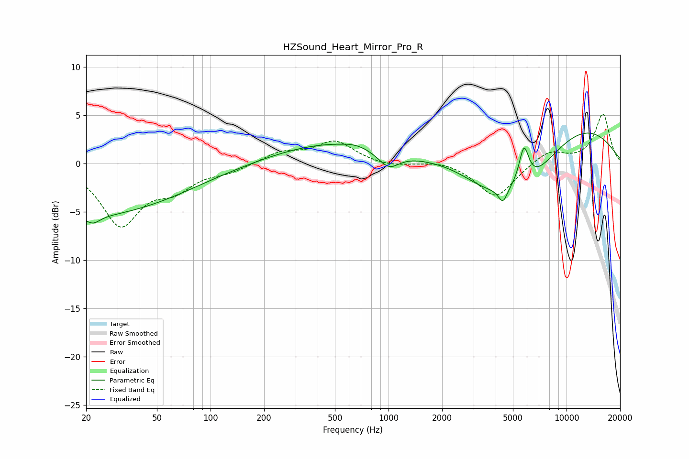

# HZSound_Heart_Mirror_Pro_R
See [usage instructions](https://github.com/jaakkopasanen/AutoEq#usage) for more options and info.

### Parametric EQs
Apply preamp of -3.2 dB when using parametric equalizer.

|   # | Type    |   Fc (Hz) |    Q |   Gain (dB) |
|-----|---------|-----------|------|-------------|
|   1 | Peaking |        20 | 0.25 |        -5.4 |
|   2 | Peaking |        22 | 3.64 |        -0.8 |
|   3 | Peaking |       491 | 0.42 |         2.2 |
|   4 | Peaking |       654 | 2.17 |         0.3 |
|   5 | Peaking |      1002 | 2.36 |        -1.7 |
|   6 | Peaking |      3449 | 1.07 |        -1.7 |
|   7 | Peaking |      4391 | 5.57 |        -1.5 |
|   8 | Peaking |      5764 | 4.9  |         3.9 |
|   9 | Peaking |      5807 | 0.67 |        -6.2 |
|  10 | Peaking |      9188 | 0.34 |         5.4 |

### Fixed Band EQs
When using fixed band (also called graphic) equalizer, apply preamp of **-5.2 dB** (if available) and set gains manually with these parameters.

|   # | Type    |   Fc (Hz) |    Q |   Gain (dB) |
|-----|---------|-----------|------|-------------|
|   1 | Peaking |        31 | 1.41 |        -6.2 |
|   2 | Peaking |        62 | 1.41 |        -2.2 |
|   3 | Peaking |       125 | 1.41 |        -0.7 |
|   4 | Peaking |       250 | 1.41 |         1.1 |
|   5 | Peaking |       500 | 1.41 |         2.2 |
|   6 | Peaking |      1000 | 1.41 |        -0.4 |
|   7 | Peaking |      2000 | 1.41 |         0.4 |
|   8 | Peaking |      4000 | 1.41 |        -3.6 |
|   9 | Peaking |      8000 | 1.41 |         1.4 |
|  10 | Peaking |     16000 | 1.41 |         5.1 |

### Graphs

