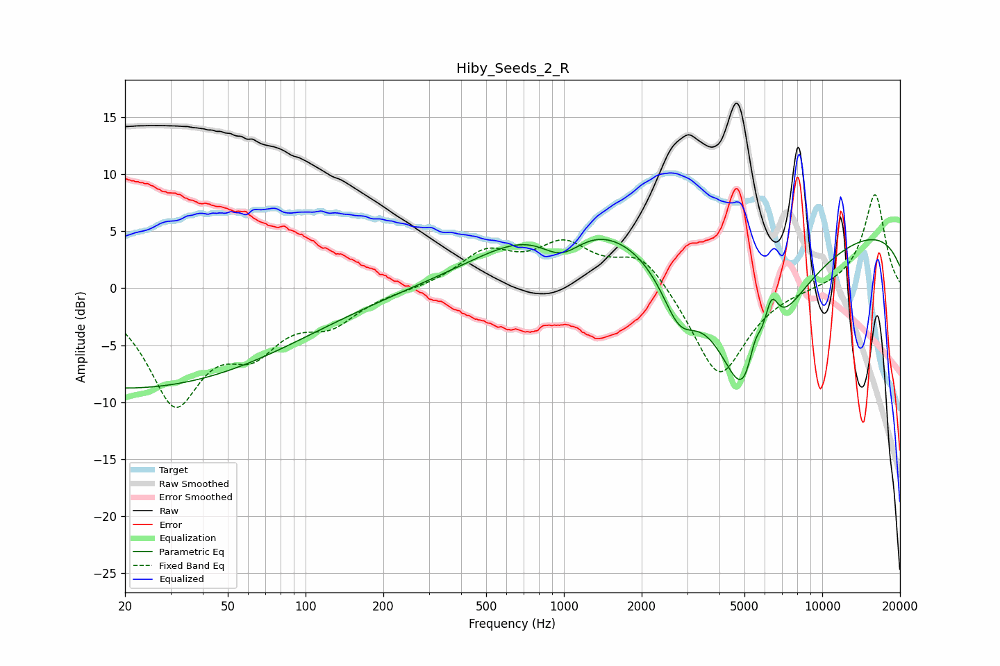

# Hiby_Seeds_2_R
See [usage instructions](https://github.com/jaakkopasanen/AutoEq#usage) for more options and info.

### Parametric EQs
Apply preamp of -4.4 dB when using parametric equalizer.

|   # | Type    |   Fc (Hz) |    Q |   Gain (dB) |
|-----|---------|-----------|------|-------------|
|   1 | Peaking |        20 | 0.2  |        -8.8 |
|   2 | Peaking |       893 | 0.52 |         4   |
|   3 | Peaking |       977 | 1.6  |        -3   |
|   4 | Peaking |      1441 | 0.52 |         2.6 |
|   5 | Peaking |      2790 | 2.11 |        -4.1 |
|   6 | Peaking |      3762 | 1.41 |         0.5 |
|   7 | Peaking |      5141 | 1.03 |       -16.5 |
|   8 | Peaking |      5483 | 4.57 |         3.9 |
|   9 | Peaking |      6345 | 4.6  |         4.2 |
|  10 | Peaking |      9964 | 0.18 |         5.8 |

### Fixed Band EQs
When using fixed band (also called graphic) equalizer, apply preamp of **-8.3 dB** (if available) and set gains manually with these parameters.

|   # | Type    |   Fc (Hz) |    Q |   Gain (dB) |
|-----|---------|-----------|------|-------------|
|   1 | Peaking |        31 | 1.41 |        -9.6 |
|   2 | Peaking |        62 | 1.41 |        -4.2 |
|   3 | Peaking |       125 | 1.41 |        -2.6 |
|   4 | Peaking |       250 | 1.41 |        -0.1 |
|   5 | Peaking |       500 | 1.41 |         3   |
|   6 | Peaking |      1000 | 1.41 |         3.5 |
|   7 | Peaking |      2000 | 1.41 |         3.2 |
|   8 | Peaking |      4000 | 1.41 |        -8.1 |
|   9 | Peaking |      8000 | 1.41 |         0   |
|  10 | Peaking |     16000 | 1.41 |         8.3 |

### Graphs

