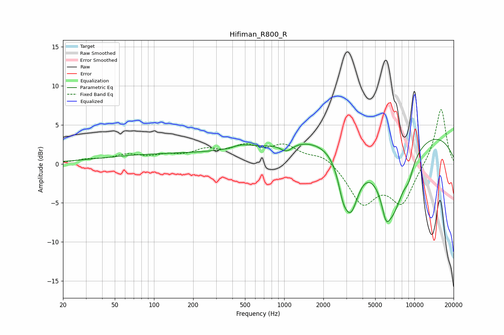

# Hifiman_R800_R
See [usage instructions](https://github.com/jaakkopasanen/AutoEq#usage) for more options and info.

### Parametric EQs
Apply preamp of -3.2 dB when using parametric equalizer.

|   # | Type    |   Fc (Hz) |    Q |   Gain (dB) |
|-----|---------|-----------|------|-------------|
|   1 | Peaking |       196 | 0.18 |         1.3 |
|   2 | Peaking |       467 | 2.01 |         0.5 |
|   3 | Peaking |      1040 | 3.03 |        -1.1 |
|   4 | Peaking |      1283 | 0.5  |         1.3 |
|   5 | Peaking |      2814 | 4.2  |        -2.1 |
|   6 | Peaking |      3227 | 2.12 |        -8   |
|   7 | Peaking |      6042 | 4.75 |        -2.3 |
|   8 | Peaking |      6744 | 1.23 |       -10.1 |
|   9 | Peaking |      8147 | 0.21 |         4.9 |
|  10 | Peaking |      9056 | 3.7  |        -1.6 |

### Fixed Band EQs
When using fixed band (also called graphic) equalizer, apply preamp of **-7.1 dB** (if available) and set gains manually with these parameters.

|   # | Type    |   Fc (Hz) |    Q |   Gain (dB) |
|-----|---------|-----------|------|-------------|
|   1 | Peaking |        31 | 1.41 |         0.4 |
|   2 | Peaking |        62 | 1.41 |         1   |
|   3 | Peaking |       125 | 1.41 |         0.8 |
|   4 | Peaking |       250 | 1.41 |         1.5 |
|   5 | Peaking |       500 | 1.41 |         1.9 |
|   6 | Peaking |      1000 | 1.41 |         2.1 |
|   7 | Peaking |      2000 | 1.41 |         1.2 |
|   8 | Peaking |      4000 | 1.41 |        -4.9 |
|   9 | Peaking |      8000 | 1.41 |        -4.9 |
|  10 | Peaking |     16000 | 1.41 |         7.3 |

### Graphs

