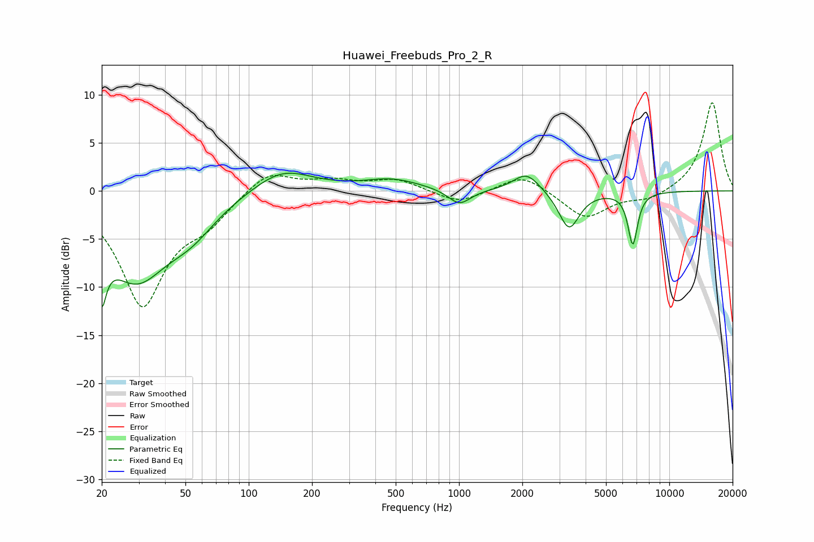

# Huawei_Freebuds_Pro_2_R
See [usage instructions](https://github.com/jaakkopasanen/AutoEq#usage) for more options and info.

### Parametric EQs
Apply preamp of -1.9 dB when using parametric equalizer.

|   # | Type    |   Fc (Hz) |    Q |   Gain (dB) |
|-----|---------|-----------|------|-------------|
|   1 | Peaking |        20 | 5.91 |        -9.2 |
|   2 | Peaking |        20 | 5.93 |         3.3 |
|   3 | Peaking |        29 | 0.88 |        -8.8 |
|   4 | Peaking |        53 | 1.21 |        -2.4 |
|   5 | Peaking |       144 | 1.01 |         2.5 |
|   6 | Peaking |       480 | 1.05 |         1.1 |
|   7 | Peaking |      1004 | 2.64 |        -1.6 |
|   8 | Peaking |      2096 | 2.24 |         2   |
|   9 | Peaking |      3336 | 2.87 |        -4   |
|  10 | Peaking |      6705 | 6    |        -5.4 |

### Fixed Band EQs
When using fixed band (also called graphic) equalizer, apply preamp of **-9.3 dB** (if available) and set gains manually with these parameters.

|   # | Type    |   Fc (Hz) |    Q |   Gain (dB) |
|-----|---------|-----------|------|-------------|
|   1 | Peaking |        31 | 1.41 |       -11.7 |
|   2 | Peaking |        62 | 1.41 |        -2.4 |
|   3 | Peaking |       125 | 1.41 |         2.3 |
|   4 | Peaking |       250 | 1.41 |         0.9 |
|   5 | Peaking |       500 | 1.41 |         1.2 |
|   6 | Peaking |      1000 | 1.41 |        -1.4 |
|   7 | Peaking |      2000 | 1.41 |         1.8 |
|   8 | Peaking |      4000 | 1.41 |        -2.9 |
|   9 | Peaking |      8000 | 1.41 |        -0.9 |
|  10 | Peaking |     16000 | 1.41 |         9.3 |

### Graphs

