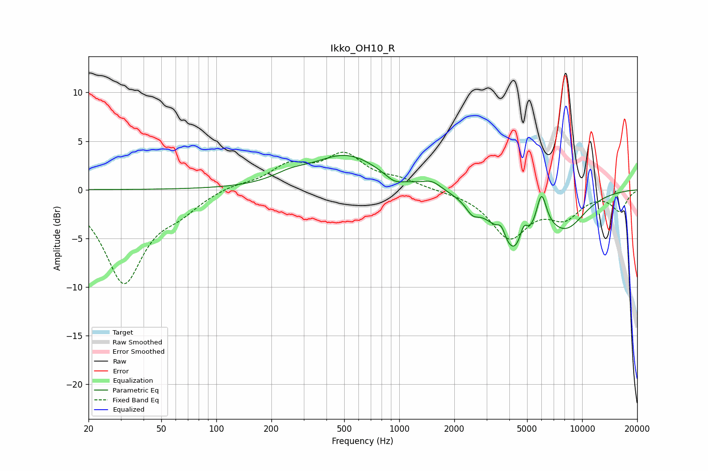

# Ikko_OH10_R
See [usage instructions](https://github.com/jaakkopasanen/AutoEq#usage) for more options and info.

### Parametric EQs
Apply preamp of -3.6 dB when using parametric equalizer.

|   # | Type    |   Fc (Hz) |    Q |   Gain (dB) |
|-----|---------|-----------|------|-------------|
|   1 | Peaking |       255 | 1.49 |         0.8 |
|   2 | Peaking |       514 | 0.77 |         3.5 |
|   3 | Peaking |       937 | 2.87 |        -0.8 |
|   4 | Peaking |      1514 | 2.81 |         0.8 |
|   5 | Peaking |      2514 | 3.93 |        -1.1 |
|   6 | Peaking |      3616 | 6    |         1.4 |
|   7 | Peaking |      4269 | 1.4  |        -6.3 |
|   8 | Peaking |      4788 | 6    |         2   |
|   9 | Peaking |      5992 | 4.96 |         3.8 |
|  10 | Peaking |      8201 | 1.2  |        -3.2 |

### Fixed Band EQs
When using fixed band (also called graphic) equalizer, apply preamp of **-4.0 dB** (if available) and set gains manually with these parameters.

|   # | Type    |   Fc (Hz) |    Q |   Gain (dB) |
|-----|---------|-----------|------|-------------|
|   1 | Peaking |        31 | 1.41 |        -9.4 |
|   2 | Peaking |        62 | 1.41 |        -1.6 |
|   3 | Peaking |       125 | 1.41 |         0.5 |
|   4 | Peaking |       250 | 1.41 |         2.3 |
|   5 | Peaking |       500 | 1.41 |         3.3 |
|   6 | Peaking |      1000 | 1.41 |         0.8 |
|   7 | Peaking |      2000 | 1.41 |        -0.1 |
|   8 | Peaking |      4000 | 1.41 |        -4.7 |
|   9 | Peaking |      8000 | 1.41 |        -2.5 |
|  10 | Peaking |     16000 | 1.41 |        -2.1 |

### Graphs

