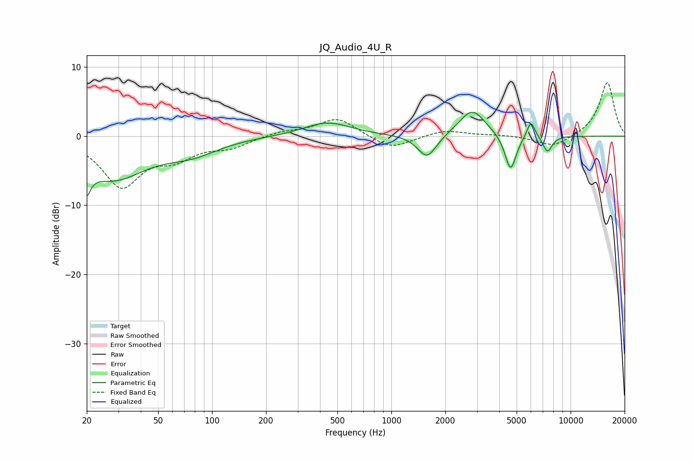

# JQ_Audio_4U_R
See [usage instructions](https://github.com/jaakkopasanen/AutoEq#usage) for more options and info.

### Parametric EQs
Apply preamp of -3.5 dB when using parametric equalizer.

|   # | Type    |   Fc (Hz) |    Q |   Gain (dB) |
|-----|---------|-----------|------|-------------|
|   1 | Peaking |        20 | 5.69 |        -7.3 |
|   2 | Peaking |        20 | 5.66 |         3.4 |
|   3 | Peaking |        28 | 0.76 |        -5.9 |
|   4 | Peaking |        77 | 0.93 |        -2   |
|   5 | Peaking |       440 | 1.1  |         2   |
|   6 | Peaking |      1583 | 2.68 |        -3.4 |
|   7 | Peaking |      2823 | 1.95 |         3.9 |
|   8 | Peaking |      4623 | 4.43 |        -5.3 |
|   9 | Peaking |      6005 | 6    |         2.5 |
|  10 | Peaking |      7429 | 5.1  |        -2.3 |

### Fixed Band EQs
When using fixed band (also called graphic) equalizer, apply preamp of **-7.8 dB** (if available) and set gains manually with these parameters.

|   # | Type    |   Fc (Hz) |    Q |   Gain (dB) |
|-----|---------|-----------|------|-------------|
|   1 | Peaking |        31 | 1.41 |        -7   |
|   2 | Peaking |        62 | 1.41 |        -2.5 |
|   3 | Peaking |       125 | 1.41 |        -1.4 |
|   4 | Peaking |       250 | 1.41 |         0.7 |
|   5 | Peaking |       500 | 1.41 |         2.7 |
|   6 | Peaking |      1000 | 1.41 |        -2   |
|   7 | Peaking |      2000 | 1.41 |         0.9 |
|   8 | Peaking |      4000 | 1.41 |         0.2 |
|   9 | Peaking |      8000 | 1.41 |        -1.6 |
|  10 | Peaking |     16000 | 1.41 |         7.8 |

### Graphs

