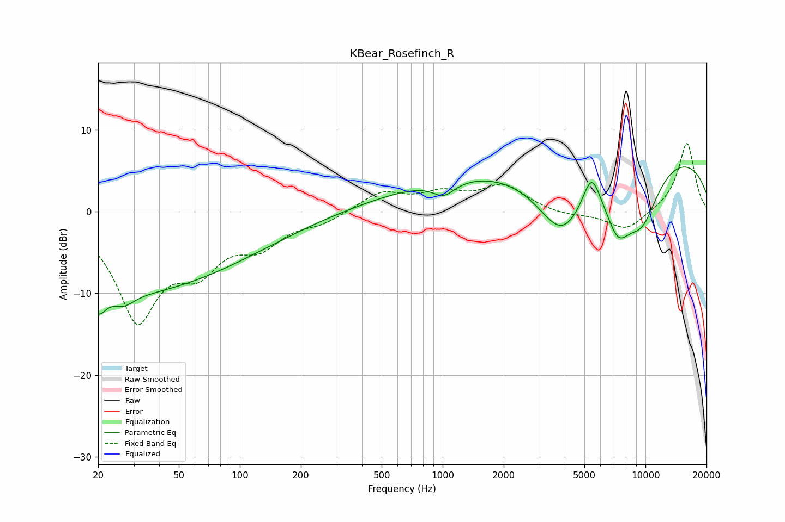

# KBear_Rosefinch_R
See [usage instructions](https://github.com/jaakkopasanen/AutoEq#usage) for more options and info.

### Parametric EQs
Apply preamp of -5.6 dB when using parametric equalizer.

|   # | Type    |   Fc (Hz) |    Q |   Gain (dB) |
|-----|---------|-----------|------|-------------|
|   1 | Peaking |        20 | 4.46 |        -2.1 |
|   2 | Peaking |        22 | 0.18 |       -10.2 |
|   3 | Peaking |        27 | 2.92 |        -1.2 |
|   4 | Peaking |      1013 | 2.62 |        -1.7 |
|   5 | Peaking |      1674 | 0.27 |         3.9 |
|   6 | Peaking |      3879 | 0.98 |        -9.9 |
|   7 | Peaking |      5420 | 3.22 |         4.3 |
|   8 | Peaking |      7316 | 2.07 |        -5.6 |
|   9 | Peaking |      9572 | 1.33 |        -7.2 |
|  10 | Peaking |      9966 | 0.2  |         7.6 |

### Fixed Band EQs
When using fixed band (also called graphic) equalizer, apply preamp of **-8.4 dB** (if available) and set gains manually with these parameters.

|   # | Type    |   Fc (Hz) |    Q |   Gain (dB) |
|-----|---------|-----------|------|-------------|
|   1 | Peaking |        31 | 1.41 |       -12.7 |
|   2 | Peaking |        62 | 1.41 |        -5.3 |
|   3 | Peaking |       125 | 1.41 |        -3.5 |
|   4 | Peaking |       250 | 1.41 |        -1.2 |
|   5 | Peaking |       500 | 1.41 |         2.3 |
|   6 | Peaking |      1000 | 1.41 |         1.9 |
|   7 | Peaking |      2000 | 1.41 |         3.1 |
|   8 | Peaking |      4000 | 1.41 |        -0.5 |
|   9 | Peaking |      8000 | 1.41 |        -2.4 |
|  10 | Peaking |     16000 | 1.41 |         8.5 |

### Graphs

