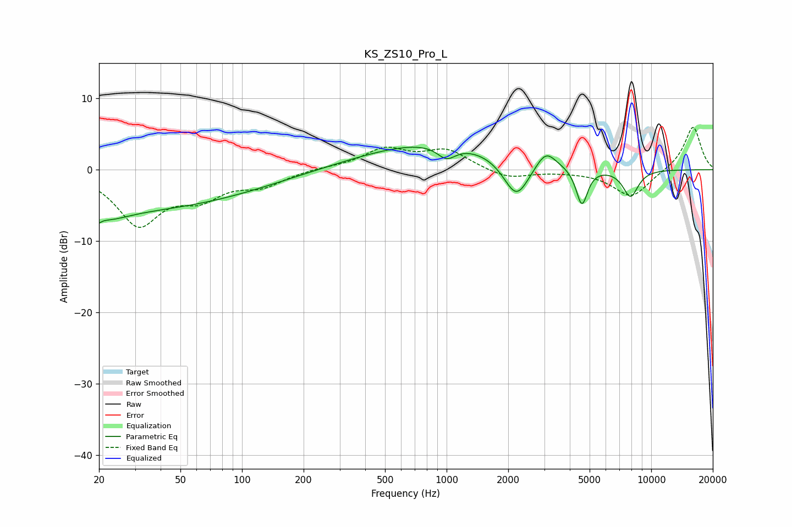

# KS_ZS10_Pro_L
See [usage instructions](https://github.com/jaakkopasanen/AutoEq#usage) for more options and info.

### Parametric EQs
Apply preamp of -3.2 dB when using parametric equalizer.

|   # | Type    |   Fc (Hz) |    Q |   Gain (dB) |
|-----|---------|-----------|------|-------------|
|   1 | Peaking |        20 | 5.7  |        -4   |
|   2 | Peaking |        20 | 5.7  |         3.4 |
|   3 | Peaking |        21 | 1.28 |        -1.5 |
|   4 | Peaking |        27 | 0.21 |        -5.5 |
|   5 | Peaking |       900 | 0.39 |         3.9 |
|   6 | Peaking |       999 | 3.11 |        -1.9 |
|   7 | Peaking |      2194 | 2.2  |        -5.7 |
|   8 | Peaking |      3056 | 2.96 |         2.5 |
|   9 | Peaking |      4584 | 4.99 |        -5.3 |
|  10 | Peaking |      7921 | 3.46 |        -3.8 |

### Fixed Band EQs
When using fixed band (also called graphic) equalizer, apply preamp of **-6.0 dB** (if available) and set gains manually with these parameters.

|   # | Type    |   Fc (Hz) |    Q |   Gain (dB) |
|-----|---------|-----------|------|-------------|
|   1 | Peaking |        31 | 1.41 |        -7.4 |
|   2 | Peaking |        62 | 1.41 |        -3.2 |
|   3 | Peaking |       125 | 1.41 |        -2   |
|   4 | Peaking |       250 | 1.41 |         0.2 |
|   5 | Peaking |       500 | 1.41 |         2.8 |
|   6 | Peaking |      1000 | 1.41 |         2.6 |
|   7 | Peaking |      2000 | 1.41 |        -1.3 |
|   8 | Peaking |      4000 | 1.41 |        -0.1 |
|   9 | Peaking |      8000 | 1.41 |        -3.9 |
|  10 | Peaking |     16000 | 1.41 |         6.2 |

### Graphs

