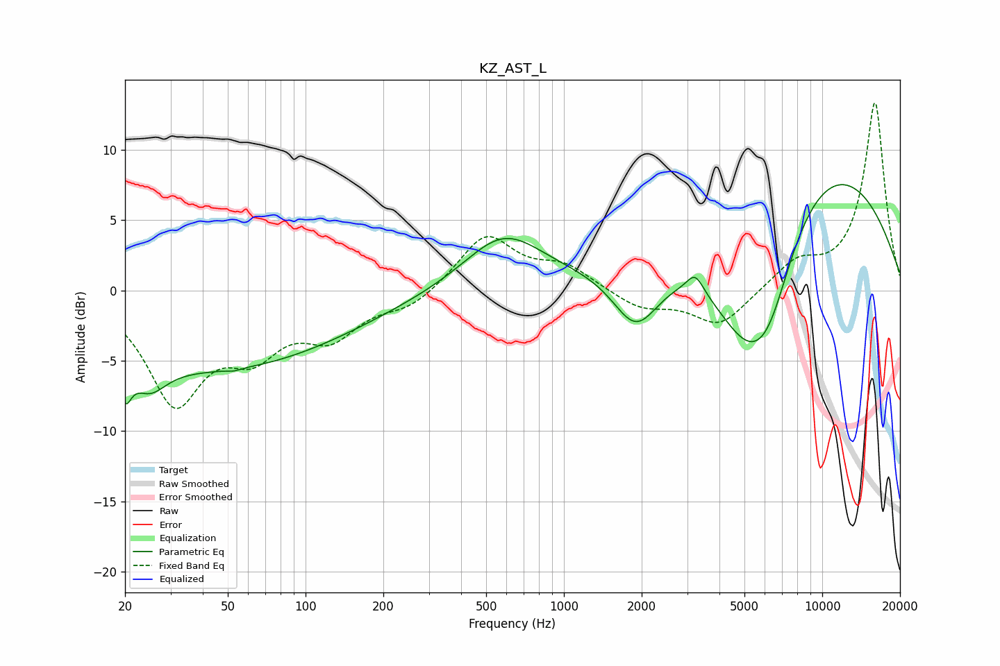

# KZ_AST_L
See [usage instructions](https://github.com/jaakkopasanen/AutoEq#usage) for more options and info.

### Parametric EQs
Apply preamp of -7.6 dB when using parametric equalizer.

|   # | Type    |   Fc (Hz) |    Q |   Gain (dB) |
|-----|---------|-----------|------|-------------|
|   1 | Peaking |        20 | 5.94 |        -2.5 |
|   2 | Peaking |        25 | 2.15 |        -2.2 |
|   3 | Peaking |        45 | 0.28 |        -5.5 |
|   4 | Peaking |        53 | 5.98 |        -0.1 |
|   5 | Peaking |       583 | 0.92 |         3.9 |
|   6 | Peaking |      1903 | 1.54 |        -4.5 |
|   7 | Peaking |      3224 | 4.35 |         1.4 |
|   8 | Peaking |      5087 | 0.81 |       -10.6 |
|   9 | Peaking |      6190 | 1.46 |        -4.5 |
|  10 | Peaking |      8004 | 0.3  |        11.8 |

### Fixed Band EQs
When using fixed band (also called graphic) equalizer, apply preamp of **-13.4 dB** (if available) and set gains manually with these parameters.

|   # | Type    |   Fc (Hz) |    Q |   Gain (dB) |
|-----|---------|-----------|------|-------------|
|   1 | Peaking |        31 | 1.41 |        -7.6 |
|   2 | Peaking |        62 | 1.41 |        -3.5 |
|   3 | Peaking |       125 | 1.41 |        -2.9 |
|   4 | Peaking |       250 | 1.41 |        -1.1 |
|   5 | Peaking |       500 | 1.41 |         3.9 |
|   6 | Peaking |      1000 | 1.41 |         1.6 |
|   7 | Peaking |      2000 | 1.41 |        -1.3 |
|   8 | Peaking |      4000 | 1.41 |        -2.6 |
|   9 | Peaking |      8000 | 1.41 |         1.8 |
|  10 | Peaking |     16000 | 1.41 |        13.4 |

### Graphs

