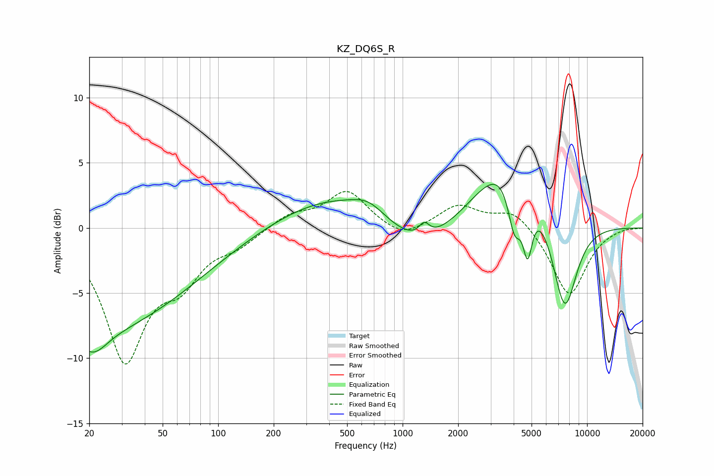

# KZ_DQ6S_R
See [usage instructions](https://github.com/jaakkopasanen/AutoEq#usage) for more options and info.

### Parametric EQs
Apply preamp of -3.4 dB when using parametric equalizer.

|   # | Type    |   Fc (Hz) |    Q |   Gain (dB) |
|-----|---------|-----------|------|-------------|
|   1 | Peaking |        20 | 0.25 |        -7.8 |
|   2 | Peaking |        21 | 1.86 |        -1.8 |
|   3 | Peaking |       453 | 0.44 |         2.7 |
|   4 | Peaking |       655 | 1.6  |         1   |
|   5 | Peaking |      1233 | 0.69 |        -2.9 |
|   6 | Peaking |      1309 | 5.12 |         1   |
|   7 | Peaking |      3783 | 0.77 |         6   |
|   8 | Peaking |      4041 | 3.74 |        -4.2 |
|   9 | Peaking |      4759 | 5.32 |        -4.3 |
|  10 | Peaking |      7551 | 1.93 |        -7.6 |

### Fixed Band EQs
When using fixed band (also called graphic) equalizer, apply preamp of **-2.9 dB** (if available) and set gains manually with these parameters.

|   # | Type    |   Fc (Hz) |    Q |   Gain (dB) |
|-----|---------|-----------|------|-------------|
|   1 | Peaking |        31 | 1.41 |        -9.8 |
|   2 | Peaking |        62 | 1.41 |        -3.2 |
|   3 | Peaking |       125 | 1.41 |        -1.1 |
|   4 | Peaking |       250 | 1.41 |         1   |
|   5 | Peaking |       500 | 1.41 |         2.8 |
|   6 | Peaking |      1000 | 1.41 |        -1   |
|   7 | Peaking |      2000 | 1.41 |         1.7 |
|   8 | Peaking |      4000 | 1.41 |         1.5 |
|   9 | Peaking |      8000 | 1.41 |        -5.3 |
|  10 | Peaking |     16000 | 1.41 |         0.1 |

### Graphs

