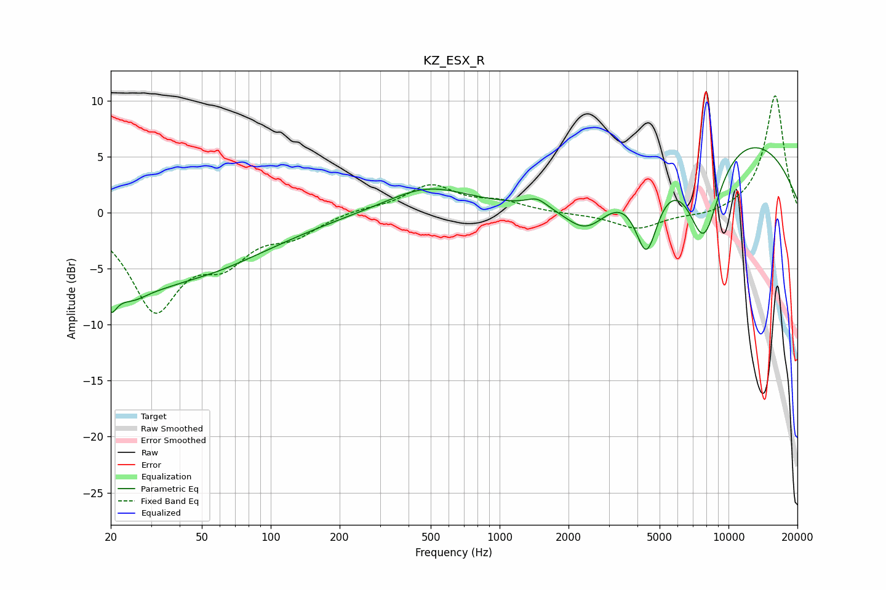

# KZ_ESX_R
See [usage instructions](https://github.com/jaakkopasanen/AutoEq#usage) for more options and info.

### Parametric EQs
Apply preamp of -5.9 dB when using parametric equalizer.

|   # | Type    |   Fc (Hz) |    Q |   Gain (dB) |
|-----|---------|-----------|------|-------------|
|   1 | Peaking |        20 | 5.42 |        -2.1 |
|   2 | Peaking |        25 | 2.15 |        -1.1 |
|   3 | Peaking |        29 | 0.31 |        -6.5 |
|   4 | Peaking |        44 | 1.59 |         0.1 |
|   5 | Peaking |       483 | 0.79 |         2.3 |
|   6 | Peaking |      1456 | 3.26 |         0.7 |
|   7 | Peaking |      2394 | 1.39 |        -3.6 |
|   8 | Peaking |      4385 | 2.72 |        -6.7 |
|   9 | Peaking |      7795 | 1.8  |        -8.5 |
|  10 | Peaking |      9502 | 0.28 |         7.5 |

### Fixed Band EQs
When using fixed band (also called graphic) equalizer, apply preamp of **-10.5 dB** (if available) and set gains manually with these parameters.

|   # | Type    |   Fc (Hz) |    Q |   Gain (dB) |
|-----|---------|-----------|------|-------------|
|   1 | Peaking |        31 | 1.41 |        -8.3 |
|   2 | Peaking |        62 | 1.41 |        -3.5 |
|   3 | Peaking |       125 | 1.41 |        -1.7 |
|   4 | Peaking |       250 | 1.41 |         0.3 |
|   5 | Peaking |       500 | 1.41 |         2.4 |
|   6 | Peaking |      1000 | 1.41 |         0.9 |
|   7 | Peaking |      2000 | 1.41 |        -0.1 |
|   8 | Peaking |      4000 | 1.41 |        -1.5 |
|   9 | Peaking |      8000 | 1.41 |        -0.4 |
|  10 | Peaking |     16000 | 1.41 |        10.6 |

### Graphs

