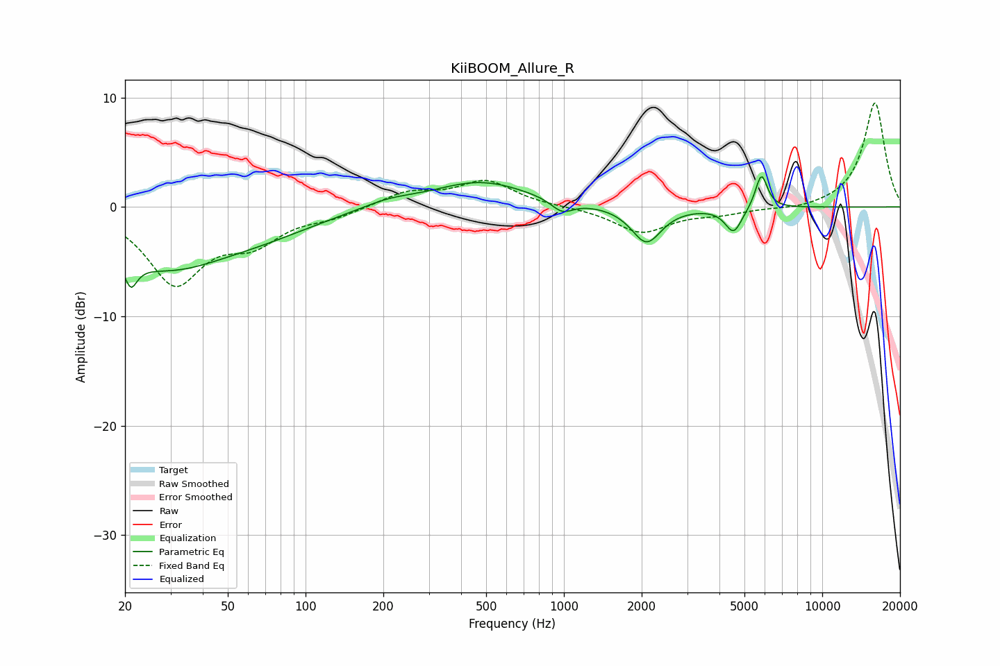

# KiiBOOM_Allure_R
See [usage instructions](https://github.com/jaakkopasanen/AutoEq#usage) for more options and info.

### Parametric EQs
Apply preamp of -2.8 dB when using parametric equalizer.

|   # | Type    |   Fc (Hz) |    Q |   Gain (dB) |
|-----|---------|-----------|------|-------------|
|   1 | Peaking |        21 | 5.8  |        -5.7 |
|   2 | Peaking |        21 | 5.96 |         3.2 |
|   3 | Peaking |        28 | 0.57 |        -5.2 |
|   4 | Peaking |        71 | 0.66 |        -1.3 |
|   5 | Peaking |       208 | 1.4  |         0.6 |
|   6 | Peaking |       474 | 0.76 |         2.3 |
|   7 | Peaking |       984 | 3.35 |        -1.1 |
|   8 | Peaking |      2087 | 2.48 |        -3.3 |
|   9 | Peaking |      4538 | 4.3  |        -2.3 |
|  10 | Peaking |      5814 | 5.99 |         3.2 |

### Fixed Band EQs
When using fixed band (also called graphic) equalizer, apply preamp of **-9.6 dB** (if available) and set gains manually with these parameters.

|   # | Type    |   Fc (Hz) |    Q |   Gain (dB) |
|-----|---------|-----------|------|-------------|
|   1 | Peaking |        31 | 1.41 |        -6.7 |
|   2 | Peaking |        62 | 1.41 |        -2.7 |
|   3 | Peaking |       125 | 1.41 |        -0.8 |
|   4 | Peaking |       250 | 1.41 |         1.3 |
|   5 | Peaking |       500 | 1.41 |         2.3 |
|   6 | Peaking |      1000 | 1.41 |         0   |
|   7 | Peaking |      2000 | 1.41 |        -2.3 |
|   8 | Peaking |      4000 | 1.41 |        -0.5 |
|   9 | Peaking |      8000 | 1.41 |        -0.3 |
|  10 | Peaking |     16000 | 1.41 |         9.6 |

### Graphs

